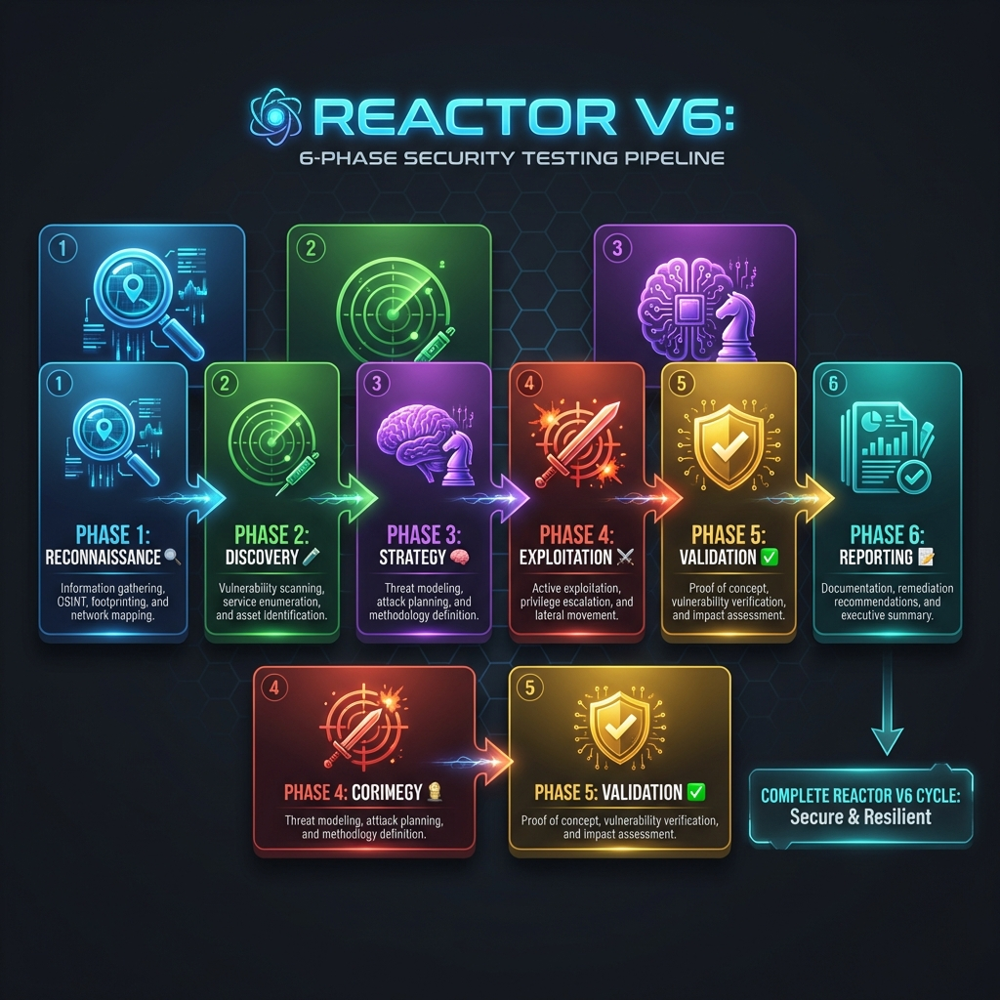
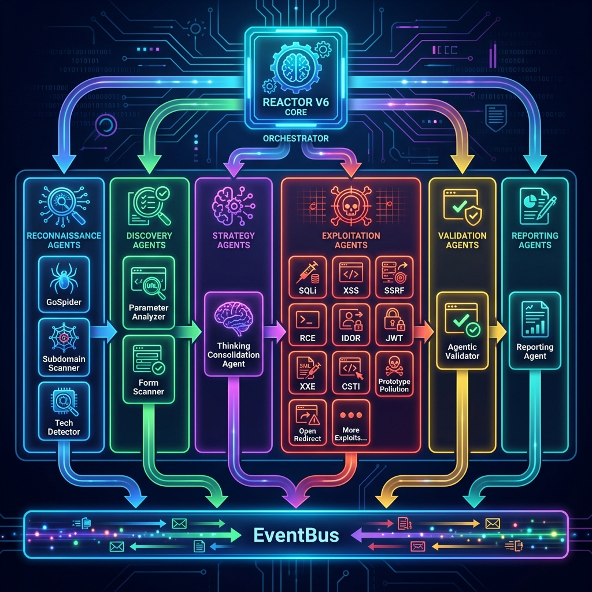
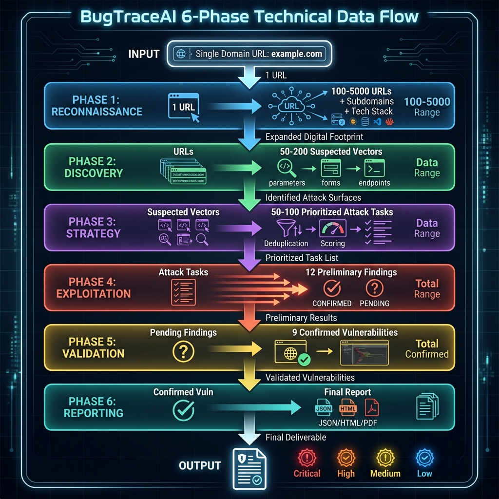

# 🏗️ Arquitectura de BugTraceAI V7.1 (TeamOrchestrator)

> **Versión**: 2.0.0 (Phoenix Edition)
> **Motor**: V7.1 TeamOrchestrator (Event-Driven Pipeline)
> **Estado**: Producción (Febrero 2026)
> **Última Actualización**: 2026-02-06

---

## 📋 Índice de Documentación

Esta carpeta contiene la documentación completa de la arquitectura del sistema BugTraceAI-CLI, organizada en las siguientes secciones:

### 📄 Documentos Principales

| Documento | Descripción | Estado |
|-----------|-------------|--------|
| [`ARCHITECTURE_V7.md`](./ARCHITECTURE_V7.md) | Arquitectura actual (V7.1 TeamOrchestrator) en producción | ✅ Producción |
| [`architecture_future.md`](./architecture_future.md) | Roadmap y visión para Q3-Q4 2026 | 📋 Planificado |
| [`SKILLS_SYSTEM.md`](./SKILLS_SYSTEM.md) | **Sistema de Skills** - Conocimiento especializado por vulnerabilidad | ✅ Producción |

### 🔄 Pipeline de 6 Fases

| Documento | Descripción | 
|-----------|-------------|
| [`phases/pipeline_phases.md`](./phases/pipeline_phases.md) | **Documento Master del Pipeline** - Detalla las 6 fases del V7.1 TeamOrchestrator con mapeo de archivos, responsabilidades y métricas |
| [`phases/flow_diagrams.md`](./phases/flow_diagrams.md) | **Diagramas Mermaid Interactivos** - Visualizaciones del flujo, secuencia, estados y componentes |

**Vista Rápida del Pipeline:**
```
RECONNAISSANCE → DISCOVERY → STRATEGY → EXPLOITATION → VALIDATION → REPORTING
      🔍            🧪          🧠            ⚔️             ✅            📝
   El Mapa      El Escáner   El Cerebro    El Enjambre    El Auditor   El Escriba
```

### 🤖 Agentes Especializados

Documentación individual de cada agente del sistema. Todos los agentes están ubicados en [`agents/`](./agents/).

#### Fase 3: Strategy
- [`thinking_consolidation_agent.md`](./agents/thinking_consolidation_agent.md) - El Estratega

#### Fase 4: Exploitation (11+ Especialistas)

**Inyecciones:**
- [`sqli_agent.md`](./agents/sqli_agent.md) - SQL Injection
- [`xss_agent.md`](./agents/xss_agent.md) - Cross-Site Scripting
- [`xxe_agent.md`](./agents/xxe_agent.md) - XML External Entity
- [`csti_agent.md`](./agents/csti_agent.md) - Client-Side Template Injection

**Ataques de Sistema:**
- [`rce_agent.md`](./agents/rce_agent.md) - Remote Code Execution
- [`lfi_agent.md`](./agents/lfi_agent.md) - Local File Inclusion
- [`ssrf_agent.md`](./agents/ssrf_agent.md) - Server-Side Request Forgery

**Lógica de Negocio:**
- [`idor_agent.md`](./agents/idor_agent.md) - Insecure Direct Object References
- [`jwt_agent.md`](./agents/jwt_agent.md) - JWT Vulnerabilities
- [`open_redirect_agent.md`](./agents/open_redirect_agent.md) - URL Redirection

**Avanzados:**
- [`prototype_pollution_agent.md`](./agents/prototype_pollution_agent.md) - JavaScript Prototype Pollution

#### Fase 5: Validation
- [`agentic_validator.md`](./agents/agentic_validator.md) - El Auditor (CDP + Vision AI)

### 🎓 Sistema de Skills

El **Skills System** proporciona conocimiento especializado por tipo de vulnerabilidad, cargado dinámicamente para enriquecer el análisis de los agentes sin saturar el contexto.

**Documentación completa**: [`SKILLS_SYSTEM.md`](./SKILLS_SYSTEM.md)

**Skills disponibles** (ubicadas en `bugtrace/agents/skills/vulnerabilities/`):
- 🔴 **XSS** (`xss.md`) - Cross-Site Scripting
- 🔴 **SQLi** (`sqli.md`) - SQL Injection
- 🟡 **SSRF** (`ssrf.md`) - Server-Side Request Forgery
- 🟡 **XXE** (`xxe.md`) - XML External Entity
- 🔴 **RCE** (`rce.md`) - Remote Code Execution
- 🟡 **LFI** (`lfi.md`) - Local File Inclusion
- 🟢 **IDOR** (`idor.md`) - Insecure Direct Object Reference
- 🟢 **JWT** (`jwt.md`) - JWT Vulnerabilities

**Uso en agentes**:
1. **DASTySASTAgent**: Carga skills dinámicamente durante el análisis multi-persona
2. **Skeptical Validator**: Usa `scoring_guide` y `false_positives` para filtrado
3. **Specialist Agents**: Cada agente puede referenciar su skill correspondiente

**API del Loader** (`bugtrace/agents/skills/loader.py`):
```python
from bugtrace.agents.skills.loader import (
    get_skill_content,          # Cargar skill completa
    get_skills_for_findings,    # Cargar múltiples skills
    get_scoring_guide,          # Extraer scoring guide
    get_false_positives         # Extraer FP patterns
)
```

### 📊 Diagramas Visuales

#### Diagramas Interactivos (Mermaid)
En [`phases/flow_diagrams.md`](./phases/flow_diagrams.md) encontrarás diagramas interactivos que se visualizan automáticamente en GitHub/GitLab:
- 📊 **Diagrama de Flujo Principal**: Vista completa de las 6 fases
- 🔄 **Diagrama de Secuencia**: Interacción entre componentes
- 🏗️ **Arquitectura de Componentes**: TeamOrchestrator, EventBus, Agents
- 🔀 **Diagrama de Estados**: Ciclo de vida de un Finding
- 🎯 **Flujo de Decisión - Validación**: Lógica de validación HTTP vs Browser
- 🧪 **Diagrama de Enjambre**: Los 11+ agentes en paralelo

#### Diagramas Estáticos (PNG)
Diagramas técnicos ubicados en [`diagrams/`](./diagrams/):

| Diagrama | Descripción | Vista Previa |
|----------|-------------|--------------|
| `pipeline_v6_diagram.png` | Flujo completo de las 6 fases del pipeline |  |
| `agents_architecture_diagram.png` | Arquitectura jerárquica del ecosistema de agentes |  |
| `data_flow_diagram.png` | Flujo de transformación de datos a través del pipeline |  |

---

## 🎯 Guía de Navegación

### Para Nuevos Desarrolladores
1. **Empieza aquí**: [`ARCHITECTURE_V7.md`](./ARCHITECTURE_V7.md) - Entiende la visión general
2. **Comprende el flujo**: [`phases/pipeline_phases.md`](./phases/pipeline_phases.md) - Estudia las 6 fases
3. **Profundiza en agentes**: Revisa los agentes en [`agents/`](./agents/) según tu área de interés

### Para Auditoría de Código
1. **Verifica mapeo**: [`phases/pipeline_phases.md`](./phases/pipeline_phases.md) - Contiene el mapeo completo de archivos por fase
2. **Valida implementación**: Compara la documentación del agente con su código en `bugtrace/agents/`

### Para Planificación de Features
1. **Revisa roadmap**: [`architecture_future.md`](./architecture_future.md)
2. **Consulta workflow**: `/implement_feature_v3` (en `.agent/workflows/`)
3. **Verifica skill**: `architecture_validator` (en `.agent/skills/`)

---

## 🔗 Referencias Cruzadas

### Documentación del Proyecto
- **Master Doc**: `../project/master_doc.md`
- **Project Storyline**: `../project/PROJECT_STORYLINE.md`
- **Technical Specs**: `../technical_specs/`

### Código Fuente
- **TeamOrchestrator**: `../../bugtrace/core/team.py`
- **Base Agent**: `../../bugtrace/agents/base_agent.py`
- **Agentes**: `../../bugtrace/agents/`
- **EventBus**: `../../bugtrace/core/event_bus.py`

---

## 📝 Convenciones de Documentación

### Estructura de Archivos de Agentes
Cada archivo de agente sigue esta estructura:
```markdown
# NombreAgente (Alias)

> **Fase**: X (Nombre de Fase)
> **Rol**: Descripción del rol
> **Clase**: `bugtrace.agents.modulo.NombreClase`

## Descripción
[Descripción detallada]

## Responsabilidades
[Lista de responsabilidades]

## Entradas y Salidas
- **Entrada**: [Formato de entrada]
- **Salida**: [Formato de salida]
```

### Actualización de Documentación
Al modificar la arquitectura:
1. **Actualiza el documento correspondiente** en esta carpeta
2. **Actualiza `pipeline_phases.md`** si afecta al flujo
3. **Regenera diagramas** si hay cambios visuales significativos
4. **Actualiza fecha** en los encabezados YAML/frontmatter

---

## 🚀 Quick Links

- 🔍 **Ver el pipeline completo**: [`phases/pipeline_phases.md`](./phases/pipeline_phases.md)
- 🤖 **Explorar agentes**: [`agents/`](./agents/)
- 📊 **Ver diagramas**: [`diagrams/`](./diagrams/)
- 🔮 **Ver roadmap**: [`architecture_future.md`](./architecture_future.md)

---

**💡 Tip**: Si buscas una vista técnica profunda del TeamOrchestrator, lee primero `ARCHITECTURE_V7.md` y luego `phases/pipeline_phases.md` para entender el flujo completo.
