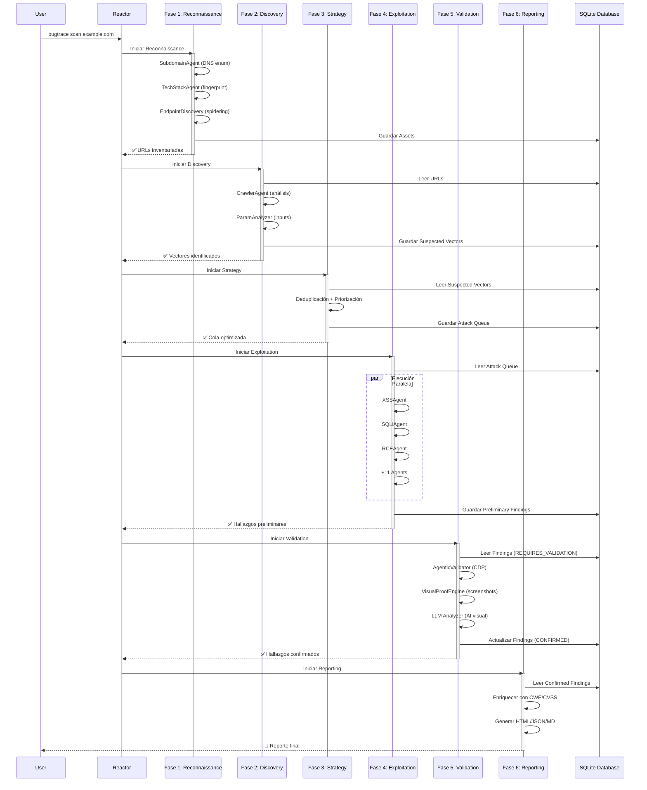
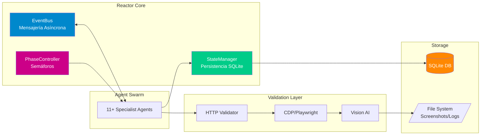
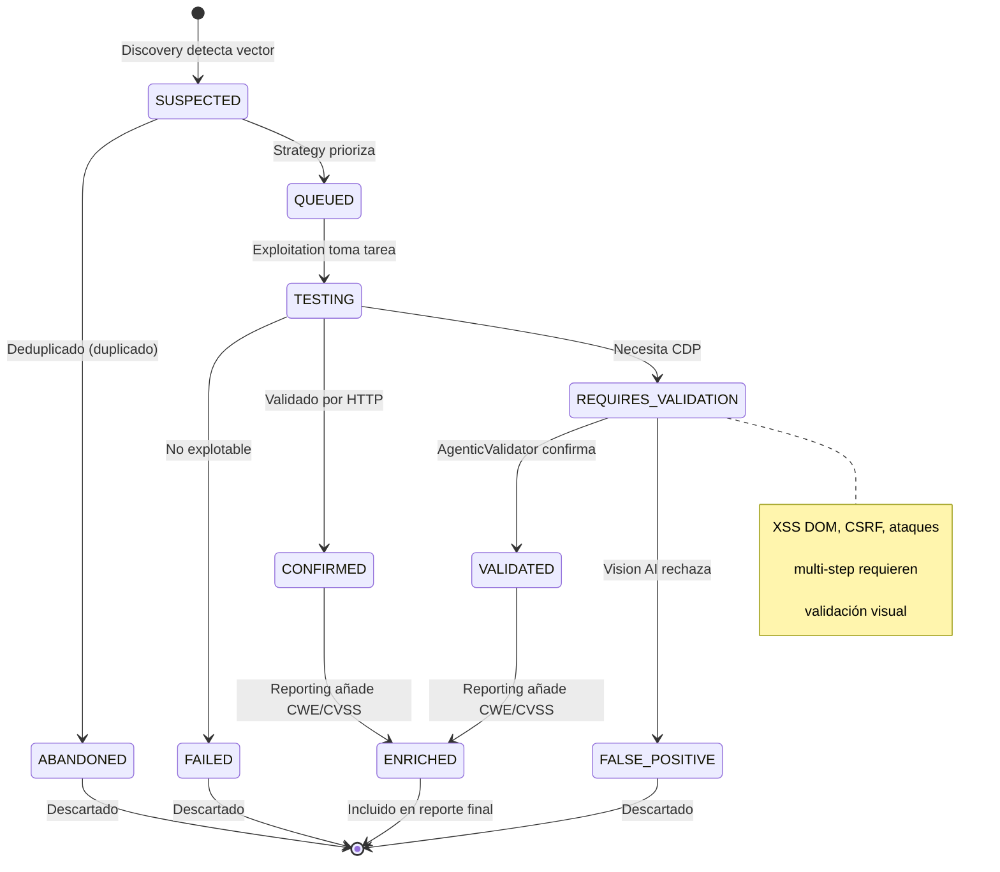
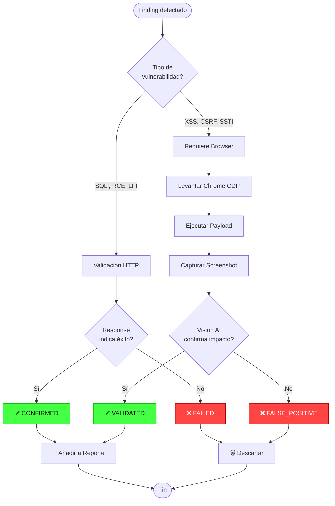

# Diagramas de Flujo - Pipeline V6

Este archivo contiene representaciones visuales del pipeline de BugTraceAI usando diagramas Mermaid.

## 📊 Diagrama de Flujo Principal (Mermaid)

```mermaid
graph TD
    Start([🎯 Dominio Target]) --> Phase1
    
    subgraph Phase1[🔍 FASE 1: RECONNAISSANCE]
        R1[SubdomainAgent]
        R2[TechStackAgent]
        R3[EndpointDiscovery]
    end
    
    Phase1 --> |URLs + Assets| Phase2
    
    subgraph Phase2[🧪 FASE 2: DISCOVERY]
        D1[CrawlerAgent]
        D2[ParamAnalyzer]
        D3[ReflectionDetector]
    end
    
    Phase2 --> |Suspected Vectors| Phase3
    
    subgraph Phase3[🧠 FASE 3: STRATEGY]
        S1[ThinkingConsolidation]
        S2[TaskPrioritizer]
        S3[Deduplicator]
    end
    
    Phase3 --> |Attack Queue| Phase4
    
    subgraph Phase4[⚔️ FASE 4: EXPLOITATION]
        E1[XSSAgent]
        E2[SQLiAgent]
        E3[RCEAgent]
        E4[SSRFAgent]
        E5[+ 11 Specialist Agents]
    end
    
    Phase4 --> |Preliminary Findings| Phase5
    
    subgraph Phase5[✅ FASE 5: VALIDATION]
        V1[AgenticValidator]
        V2[VisualProofEngine]
        V3[LLM Analyzer]
    end
    
    Phase5 --> |Confirmed Findings| Phase6
    
    subgraph Phase6[📝 FASE 6: REPORTING]
        Rep1[ReportGenerator]
        Rep2[CVSSCalculator]
        Rep3[EnrichmentEngine]
    end
    
    Phase6 --> End([📄 Final Report])
    
    style Start fill:#00d4aa,stroke:#00a080,color:#000
    style End fill:#00d4aa,stroke:#00a080,color:#000
    style Phase1 fill:#1a1a2e,stroke:#0088cc
    style Phase2 fill:#1a1a2e,stroke:#00cc88
    style Phase3 fill:#1a1a2e,stroke:#cc0088
    style Phase4 fill:#1a1a2e,stroke:#ff4444
    style Phase5 fill:#1a1a2e,stroke:#44ff44
    style Phase6 fill:#1a1a2e,stroke:#4444ff
```



## 🔄 Diagrama de Secuencia - Flujo de Datos



## 🏗️ Arquitectura de Componentes



## 🔀 Diagrama de Estados de Finding



## 📋 Tabla de Responsabilidades por Fase

| Fase | Componentes Principales | Entrada | Salida | Paralelismo |
|------|------------------------|---------|--------|-------------|
| **1. Reconnaissance** | `gospider_agent.py`<br>`tech_stack_detector.py`<br>`endpoint_discovery.py` | Dominio raíz | urls.txt + Tech Stack | ✅ 1 worker (GoSpider) |
| **2. Discovery** | `gospider_agent.py` (spidering)<br>`dastysast_agent.py` (análisis)<br>`reflection_detector.py` | urls.txt | dastysast/*.json | ✅ 1 GoSpider + 5 DAST |
| **3. Strategy** | `thinking_consolidation_agent.py`<br>`task_prioritizer.py` | dastysast/*.json | work_queued_* events | ❌ 1 worker (CPU-bound) |
| **4. Exploitation** | `xss_agent.py`, `sqli_agent.py`<br>`rce_agent.py`, (+11 más) | Specialist Queues | Preliminary Findings | ✅ 10 workers (pool HTTP: 50) |
| **5. Validation** | `agentic_validator.py`<br>`cdp_client.py` (single Chrome)<br>`vision_ai.py` (Gemini) | XSS/CSTI Findings | Confirmed Findings | ❌ 1 worker (CDP single-session) |
| **6. Reporting** | `reporting_agent.py`<br>`cvss_calculator.py`<br>`enrichment_engine.py` | Confirmed Findings | final_report.{html,json,md} | ❌ 1 worker |

## 🎯 Flujo de Decisión - Validación



## 🧪 Diagrama de Enjambre - Phase 4

```mermaid
graph TD
    Queue[(Attack Queue<br/>SQLite)]
    
    Queue --> Dispatcher{Task<br/>Dispatcher}
    
    Dispatcher --> XSS[XSSAgent<br/>CWE-79]
    Dispatcher --> SQLi[SQLiAgent<br/>CWE-89]
    Dispatcher --> RCE[RCEAgent<br/>CWE-78]
    Dispatcher --> SSRF[SSRFAgent<br/>CWE-918]
    Dispatcher --> LFI[LFIAgent<br/>CWE-22]
    Dispatcher --> XXE[XXEAgent<br/>CWE-611]
    Dispatcher --> IDOR[IDORAgent<br/>CWE-639]
    Dispatcher --> JWT[JWTAgent<br/>CWE-287]
    Dispatcher --> CSTI[CSTIAgent<br/>CWE-94]
    Dispatcher --> OpenRedir[OpenRedirectAgent<br/>CWE-601]
    Dispatcher --> ProtoPoll[PrototypePollutionAgent<br/>CWE-1321]
    
    XSS --> Results[(Findings DB)]
    SQLi --> Results
    RCE --> Results
    SSRF --> Results
    LFI --> Results
    XXE --> Results
    IDOR --> Results
    JWT --> Results
    CSTI --> Results
    OpenRedir --> Results
    ProtoPoll --> Results
    
    style Queue fill:#0088cc,color:#fff
    style Dispatcher fill:#cc0088,color:#fff
    style Results fill:#00cc88,color:#fff
    
    style XSS fill:#1a1a2e,stroke:#ff6b6b
    style SQLi fill:#1a1a2e,stroke:#4ecdc4
    style RCE fill:#1a1a2e,stroke:#f7b731
    style SSRF fill:#1a1a2e,stroke:#5f27cd
    style LFI fill:#1a1a2e,stroke:#00d2d3
    style XXE fill:#1a1a2e,stroke:#ff9ff3
    style IDOR fill:#1a1a2e,stroke:#54a0ff
    style JWT fill:#1a1a2e,stroke:#48dbfb
    style CSTI fill:#1a1a2e,stroke:#1dd1a1
    style OpenRedir fill:#1a1a2e,stroke:#feca57
    style ProtoPoll fill:#1a1a2e,stroke:#ee5a6f
```



---

## 🔍 Cómo Visualizar Estos Diagramas

### En GitHub/GitLab
Los diagramas Mermaid se renderizarán automáticamente al visualizar este archivo en GitHub o GitLab.

### En VSCode
Instala la extensión **Markdown Preview Mermaid Support**:
```bash
code --install-extension bierner.markdown-mermaid
```

### Online
Copia el código Mermaid en: https://mermaid.live/

### Generar Imágenes
Usa `mmdc` (Mermaid CLI):
```bash
npm install -g @mermaid-js/mermaid-cli
mmdc -i flow_diagrams.md -o diagrams/
```
