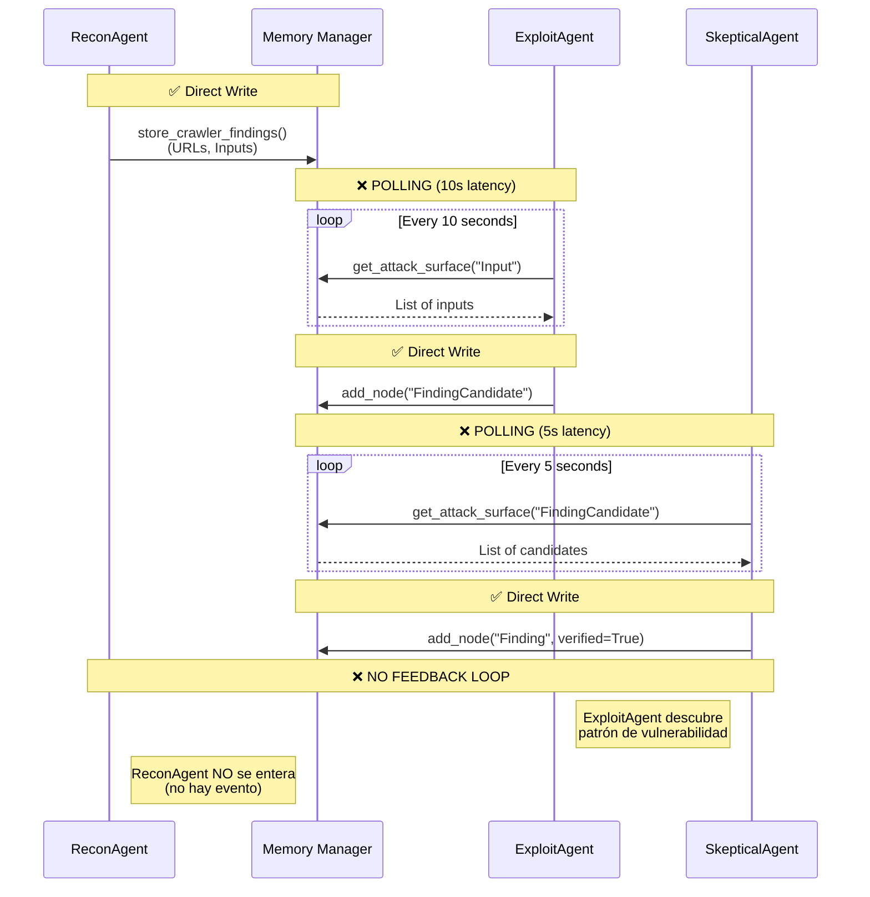
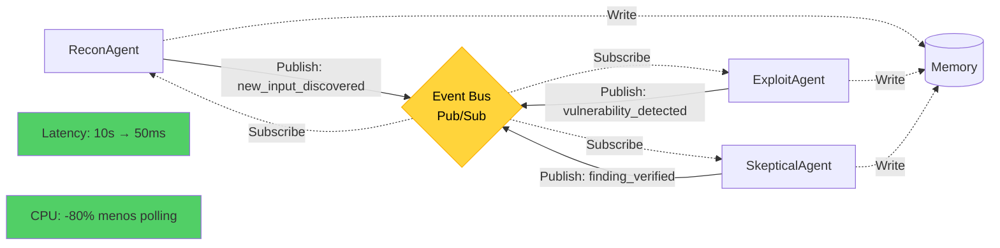
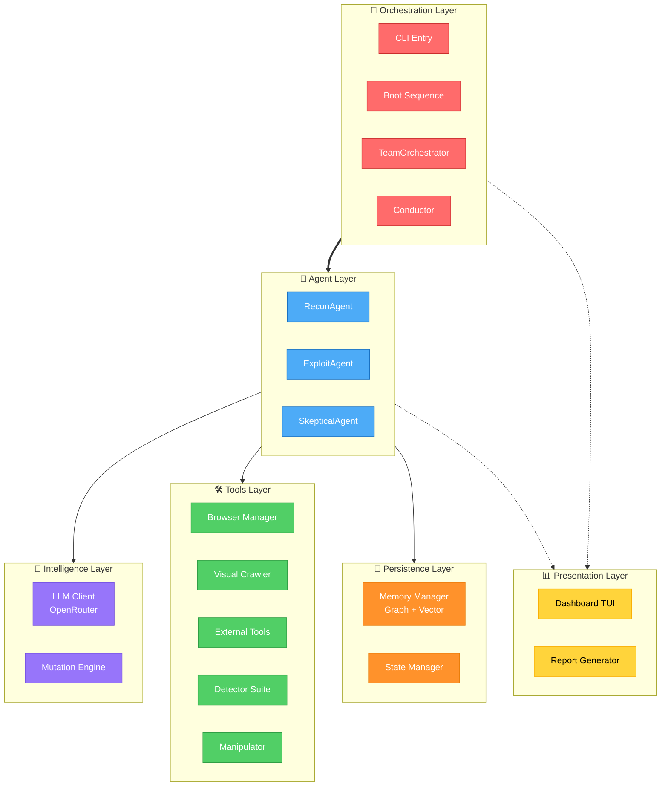

# BugtraceAI-CLI Architecture Flowchart
## Sistema de Flujo Visual - Generado desde logic_map.json

---

## Visualizar Online

Copia el código Mermaid de abajo y pégalo en:
🔗 **https://mermaid.live**

---

## Diagrama Completo del Sistema

```mermaid
flowchart TB
    %% ENTRY POINT
    CLI[CLI Entry Point<br/>__main__.py]
    BOOT[Boot Sequence<br/>Health Checks]
    
    %% ORCHESTRATION LAYER
    ORCH[TeamOrchestrator<br/>Master Coordinator]
    COND[Conductor<br/>Protocol Manager]
    
    %% AGENTS
    RECON[ReconAgent<br/>Discovery]
    EXPLOIT[ExploitAgent<br/>Offensive]
    SKEPTIC[SkepticalAgent<br/>Verification]
    
    %% INTELLIGENCE
    LLM[LLM Client<br/>OpenRouter API]
    MUTATION[Mutation Engine<br/>AI Payloads]
    
    %% TOOLS
    BROWSER[Browser Manager<br/>Playwright]
    CRAWLER[Visual Crawler<br/>SPA Support]
    EXTERNAL[External Tools<br/>Docker]
    MANIPULATOR[Manipulator<br/>HTTP Mutations]
    DETECTORS[Detector Suite<br/>SQLi/XSS/etc]
    
    %% PERSISTENCE
    MEMORY[(Memory Manager<br/>Graph + Vector DB)]
    STATE[(State Manager<br/>JSON Files)]
    
    %% PRESENTATION
    DASH[Dashboard<br/>Rich TUI]
    REPORT[Report Generator<br/>HTML + Jinja2]
    
    %% EXTERNAL TOOLS
    GOSPIDER[GoSpider]
    NUCLEI[Nuclei]
    SQLMAP[SQLMap]
    
    %% CONNECTIONS - Entry Flow
    CLI -->|Run| BOOT
    BOOT -->|Success| ORCH
    
    %% CONNECTIONS - Orchestrator Init
    ORCH -->|Initialize| BROWSER
    ORCH -->|Verify| LLM
    ORCH -->|Launch| DASH
    ORCH -->|Load Protocols| COND
    
    %% CONNECTIONS - Agent Spawning
    ORCH ==>|Spawn Concurrent| RECON
    ORCH ==>|Spawn Concurrent| EXPLOIT
    ORCH ==>|Spawn Concurrent| SKEPTIC
    
    %% CONNECTIONS - Protocol Injection
    COND -.->|Inject system_prompt| RECON
    COND -.->|Inject system_prompt| EXPLOIT
    COND -.->|Inject system_prompt| SKEPTIC
    
    %% CONNECTIONS - ReconAgent Flow
    RECON -->|Phase 0: Screenshot| BROWSER
    RECON -->|Phase 0: Visual Analysis| LLM
    RECON -->|Phase 1: Crawl| CRAWLER
    RECON -->|Phase 2: Path Predict| LLM
    RECON -->|Phase 3: Deep Scan| EXTERNAL
    RECON -->|Store Findings| MEMORY
    
    %% CONNECTIONS - Crawler Dependencies
    CRAWLER -.->|Uses| BROWSER
    
    %% CONNECTIONS - External Tools
    EXTERNAL -->|Run| GOSPIDER
    EXTERNAL -->|Run| NUCLEI
    EXTERNAL -->|Run| SQLMAP
    BROWSER -.->|Export Cookies| EXTERNAL
    
    %% CONNECTIONS - ExploitAgent Flow
    EXPLOIT -->|POLLING Every 10s| MEMORY
    EXPLOIT -->|WAF Detection| LLM
    EXPLOIT -->|Light Checks| DETECTORS
    EXPLOIT -->|AI Mutations| MUTATION
    EXPLOIT -->|Heavy Check| EXTERNAL
    EXPLOIT -->|Get Cookies| BROWSER
    EXPLOIT -->|Store Candidates| MEMORY
    
    %% CONNECTIONS - Mutation Engine
    MUTATION -.->|Uses| LLM
    
    %% CONNECTIONS - SkepticalAgent Flow
    SKEPTIC -->|POLLING Every 5s| MEMORY
    SKEPTIC -->|Visual XSS Verify| BROWSER
    SKEPTIC -->|Screenshot Analysis| LLM
    SKEPTIC -->|HTTP Mutations| MANIPULATOR
    SKEPTIC -->|Store Verified| MEMORY
    
    %% CONNECTIONS - Final Report
    ORCH -->|After Scan| REPORT
    REPORT -->|Read Findings| MEMORY
    REPORT -->|AI Summary| LLM
    
    %% CONNECTIONS - Dashboard Logging
    RECON -.->|Logs| DASH
    EXPLOIT -.->|Logs| DASH
    SKEPTIC -.->|Logs| DASH
    
    %% CONNECTIONS - State Persistence
    ORCH -.->|Save on Exit| STATE
    
    %% STYLING
    classDef orchestration fill:#ff6b6b,stroke:#c92a2a,color:#fff
    classDef agent fill:#4dabf7,stroke:#1971c2,color:#fff
    classDef intelligence fill:#9775fa,stroke:#6741d9,color:#fff
    classDef tool fill:#51cf66,stroke:#2f9e44,color:#fff
    classDef persistence fill:#ff922b,stroke:#e67700,color:#fff
    classDef presentation fill:#ffd43b,stroke:#fab005,color:#000
    classDef external fill:#868e96,stroke:#495057,color:#fff
    
    class ORCH,COND orchestration
    class RECON,EXPLOIT,SKEPTIC agent
    class LLM,MUTATION intelligence
    class BROWSER,CRAWLER,EXTERNAL,MANIPULATOR,DETECTORS tool
    class MEMORY,STATE persistence
    class DASH,REPORT presentation
    class GOSPIDER,NUCLEI,SQLMAP external
```



---

## Diagrama de Comunicación (Issues Actuales)



---

## Diagrama Propuesto con Event Bus



---

## Capas Arquitectónicas



---

## Cómo Visualizar

1. **Copia TODO el código Mermaid** (desde ` ```mermaid ` hasta ` ``` `)
2. Ve a **https://mermaid.live**
3. **Pega** el código en el editor
4. El diagrama se renderiza automáticamente
5. Puedes exportar como PNG/SVG

---

## Leyenda de Colores en Diagramas

- 🔴 **Rojo**: Orchestration (TeamOrchestrator, Conductor)
- 🔵 **Azul**: Agents (Recon, Exploit, Skeptic)
- 🟣 **Púrpura**: Intelligence (LLM, Mutation)
- 🟢 **Verde**: Tools (Browser, Crawler, External)
- 🟠 **Naranja**: Persistence (Memory, State)
- 🟡 **Amarillo**: Presentation (Dashboard, Reports)
- ⚫ **Gris**: External Tools (GoSpider, Nuclei, SQLMap)

---

## Tipos de Conexiones

- `-->` : Flujo directo (llamada de función)
- `==>` : Flujo concurrente (asyncio.gather)
- `-.->` : Flujo indirecto (inyección, logs)
- `Loop` : Polling (issue actual)

---

**Generado desde**: `.ai-context/logic_map.json`  
**Fecha**: 2026-01-01  
**Versión**: 1.2.0
