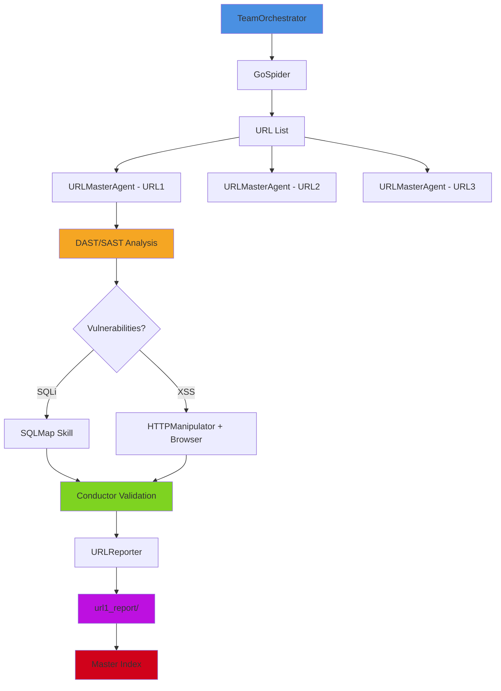

# Sistema de Reportes por URL - BugtraceAI-CLI

## 📋 Resumen

El sistema de reportes por URL genera **carpetas individuales** para cada URL analizada, conteniendo:
- ✅ Análisis DAST/SAST combinado
- ✅ Vulnerabilidades encontradas y **VALIDADAS**
- ✅ **Screenshots para VALIDACIÓN de XSS** (captura del popup/alert)
- ✅ Metadata técnica

## ⚠️ IMPORTANTE: Validación XSS

**Los screenshots NO son "evidencias decorativas"**, son **VALIDACIÓN CRÍTICA**:
- La **ÚNICA manera** de confirmar que un XSS funciona es capturar el alert/popup en el navegador
- El vision model analiza el screenshot para confirmar la ejecución del payload
- Sin screenshot del popup → XSS NO validado

**Vulnerabilidades no-visuales (SQLi, LFI, etc.):**
- Se validan con error messages, time delays, o datos extraídos
- **NO requieren screenshots** (pérdida de tiempo y recursos)

## 🏗️ Estructura de Directorios

```
reports/
└── {target}_{timestamp}/
    └── url_reports/
        ├── INDEX.md                    # Índice maestro de todas las URLs
        ├── {url1_hash}/
        │   ├── README.md               # Resumen rápido
        │   ├── analysis_dast_sast.md   # 📊 Análisis DAST/SAST
        │   ├── vulnerabilities.md      # 🔍 Reporte de vulnerabilidades
        │   ├── vulnerabilities.json    # 💾 Formato machine-readable
        │   ├── metadata.json           # ⚙️ Metadata técnica
        │   └── screenshots/            # 📸 VALIDACIÓN XSS (popup alerts)
        │       └── xss_alert_popup.png
        ├── {url2_hash}/
        │   └── ...
        └── {url3_hash}/
            └── ...
```

## 🎯 Componentes Implementados

### 1. URLReporter (`bugtrace/reporting/url_reporter.py`)

**Responsabilidades:**
- Generar carpetas individuales por URL
- Crear reportes DAST/SAST combinados
- Organizar vulnerabilidades por severidad
- Gestionar screenshots y evidencias
- Generar índice maestro

**Métodos principales:**
```python
create_url_report(
    url: str,
    analysis_results: Dict,
    vulnerabilities: List[Dict],
    screenshots: Optional[List[str]],
    metadata: Optional[Dict]
) -> Path
```

### 2. Integración con URLMasterAgent

Modificado `URLMasterAgent._generate_summary()` para:
- Detectar si existe un directorio de reportes
- Recopilar análisis DAST/SAST del thread
- Extraer vulnerabilidades validadas
- Calcular nivel de riesgo general
- Generar reporte individual automáticamente

## 📁 Contenido de Reportes

### analysis_dast_sast.md
Reporte combinado que incluye:
- **Metadata**: Parámetros, tech stack, tiempos de respuesta
- **DAST Analysis**: Pruebas dinámicas, confianza, hallazgos
- **SAST Analysis**: Patrones de código vulnerables detectados
- **Risk Assessment**: Nivel de riesgo general y recomendaciones

### vulnerabilities.md
Lista detallada de vulnerabilidades con:
- Agrupación por severidad (CRITICAL → INFORMATIONAL)
- Parámetro vulnerable
- Payload utilizado
- Nivel de confianza
- Estado de validación (visual proof si aplica)
- Link a screenshots

### vulnerabilities.json
Formato machine-readable para:
- Integración con otras herramientas
- Post-procesamiento
- CI/CD pipelines

### metadata.json
Información técnica:
- Parámetros de la URL
- Stack tecnológico detectado
- Duración del análisis
- Iteraciones del agente
- Thread ID para trazabilidad

## 🔄 Flujo de Ejecución



## 🚀 Uso

### Modo Automático (integrado en URLMasterAgent)

Cuando un `URLMasterAgent` termina su análisis:
```python
summary = await url_master_agent.run()
# El reporte se genera automáticamente si orchestrator.report_dir existe
print(f"Reporte generado en: {summary['url_report_path']}")
```

### Modo Manual (standalone)

```python
from bugtrace.reporting.url_reporter import URLReporter

url_reporter = URLReporter("reports/target_20260104")

report_path = url_reporter.create_url_report(
    url="http://example.com/page?id=1",
    analysis_results={
        'dast': {'status': 'COMPLETED', 'confidence': 90},
        'sast': {'patterns': [...]},
        'overall_risk': 'HIGH'
    },
    vulnerabilities=[
        {
            'type': 'SQLi',
            'parameter': 'id',
            'payload': "1' OR '1'='1",
            'severity': 'HIGH',
            'validated': True
        }
    ],
    screenshots=['screenshots/sqli_proof.png'],
    metadata={'params': {'id': '1'}, 'tech_stack': ['PHP']}
)

# Generar índice maestro
url_reporter.generate_master_index()
```

## 🧪 Demo

Para ver la estructura en acción:
```bash
python3 demo_url_reports.py
```

Esto genera:
- ✅ 4 URLs de ejemplo
- ✅ Reportes completos con DAST/SAST
- ✅ Vulnerabilidades de diferentes severidades
- ✅ Índice maestro navegable

## 📊 Ventajas del Sistema

1. **Organización Clara**: Cada URL tiene su propio directorio aislado
2. **Trazabilidad**: Metadata completa con thread IDs y timestamps
3. **Múltiples Formatos**: Markdown (humano) + JSON (máquina)
4. **Evidencias Visuales**: Screenshots organizados por URL
5. **Escalabilidad**: Fácil agregar nuevos tipos de reportes
6. **Integración**: Se genera automáticamente durante el análisis

## 🔗 Integración con Arquitectura Existente

```
TeamOrchestrator (core/team.py)
    ├─→ GoSpider → URL Discovery
    ├─→ URLMasterAgent × N (agents/url_master.py)
    │   ├─→ Skills (XSS, SQLi, LFI, etc.)
    │   ├─→ Conductor Validation
    │   └─→ URLReporter ← NUEVA INTEGRACIÓN
    │       └─→ url_reports/{url_hash}/
    └─→ ReportingAgent (agents/reporting.py)
        └─→ Agrega todos los reportes individuales
```

## 🎨 Screenshot del Índice

El `INDEX.md` generado muestra:
- 📊 Total de URLs analizadas
- ✅/🔴 Estado visual por URL (con/sin vulnerabilidades)
- 🔗 Links directos a cada reporte individual
- 📁 Nombres de carpetas para acceso directo

## 🔮 Futuras Mejoras

- [ ] Generar gráficos de severidad por URL
- [ ] Sistema de comparación entre scans
- [ ] Exportación a PDF
- [ ] Dashboard interactivo HTML
- [ ] Integración con GraphRAG para contexto histórico

---

**Autor**: BugtraceAI-CLI Team  
**Versión**: 2.0.0  
**Fecha**: 2026-01-04
