# XSSAgent v3 - Intelligent DAST Architecture

## Version: 3.1.0 | Status: FULLY IMPLEMENTED & VERIFIED

---

## 🎯 Architectural Philosophy

The XSSAgent v3 has evolved from a simple "payload injector" into a **Logic-Driven DAST Engine**. The core philosophy is **"Proof of Execution over Reflection"**. To achieve high confidence and zero false positives, the agent follows a multi-stage approach:

1. **Deep DAST Probing**: Character-by-character stress test to map parameter sanitization behaviors.
2. **Logic-Driven Payloads**: Payloads are built dynamically based on discovered "Allowed Character Sets" (ACS) and markers.
3. **Strict Proof of Execution (PoE)**: Validation requires definitive proof of JS execution (DOM markers or OOB callbacks).
4. **Multi-Layered Validation**: Orchestration of OOB (Interactsh), local DOM/CDP inspection, and Vision analysis.

---

## 🔄 Execution Workflow

```mermaid
graph TD
    A[Parameter Discovery] --> B[Phase 1: Deep DAST Probing]
    B --> C{Reflection Found?}
    C -->|No| D[SAST: JS Sink Analysis]
    C -->|Yes| E[Phase 2: Logic-Driven Generation]
    
    E --> F[Generate PoE Payload BTPOE_xxxx]
    F --> G[Phase 3: Multi-Layered Validation]
    
    G --> H{Interactsh OOB Hit?}
    H -->|Yes| I[✅ XSS CONFIRMED]
    H -->|No| J{Local PoE Marker Found?}
    
    J -->|Yes| I
    J -->|No| K[Phase 4: LLM Bypass Attempt]
    
    K --> L{Bypass Success?}
    L -->|Yes| I
    L -->|No| M[❌ Not Vulnerable]
```

---

## 🛠️ Phase Details

### Phase 1: Deep DAST Probing (`_deep_probe_sanitization`)

Before any exploitation, the agent stress-tests the parameter with a set of special characters (`<`, `>`, `"`, `'`, `/`, `(`, `)`, `;`, `[`, `]`).

- **Goal**: Build a **Sanitization Map**.
- **Detection**: Identifies if characters are permitted "raw", "escaped" (e.g., `&lt;`), or "stripped".
- **Outcome**: Deterministic knowledge of what characters can be used to break context.

### Phase 2: Logic-Driven Payloads

Instead of static lists, payloads are constructed based on the Sanitization Map.

- **Example**: If `<script>` is filtered but `<svg/onload>` is allowed (raw `lt` and `slash`), the agent prefers the SVG vector.
- **BTPOE Markers**: Every payload includes a unique DOM marker (`id="BTPOE_xxxx"`) and an OOB callback.

### Phase 3: Strict Proof of Execution (PoE)

Validation no longer relies on seeing the payload string in the HTML (which caused 100% false positives on sanitized sites).

- **Interactsh OOB**: Strongest proof. A callback from the client's browser confirms execution.
- **DOM Marker Detection**: The `XSSVerifier` checks if a specific `div` with a unique ID was *actually created* in the DOM.
- **CDP/Playwright Alerts**: Real-time detection of `window.alert` dialogs.

---

## 📁 Key Components

| Component | File | Responsibility |
| :--- | :--- | :--- |
| **XSSAgent** | `bugtrace/agents/xss_agent.py` | Orchestrates probing, generation, and hybrid flow routing. |
| **XSSVerifier** | `bugtrace/tools/visual/verifier.py` | Performs headless browser validation with strict PoE checks. |
| **CDPClient** | `bugtrace/core/cdp_client.py` | Direct Chrome DevTools Protocol interaction for reliable marker detection. |
| **InteractshClient** | `bugtrace/tools/interactsh.py` | Manages OOB sessions and polls for callbacks. |

---

## 📊 Evaluation Results (ginandjuice.shop)

During development, the v3 engine was verified against `ginandjuice.shop/catalog`:

- **Legacy Flow**: Reported 2 "Validated" findings (False Positives).
- **XSSAgent v3**: Correctly reported **0 findings**. Its probing detected HTML encoding on the `searchTerm` and `category` parameters, and its strict PoE validation rejected all reflected payloads because no JS execution occurred.

---

*Last Updated: 2026-01-11 | Phoenix Edition v2.1.0*
