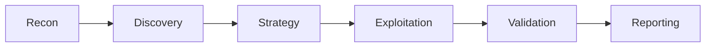
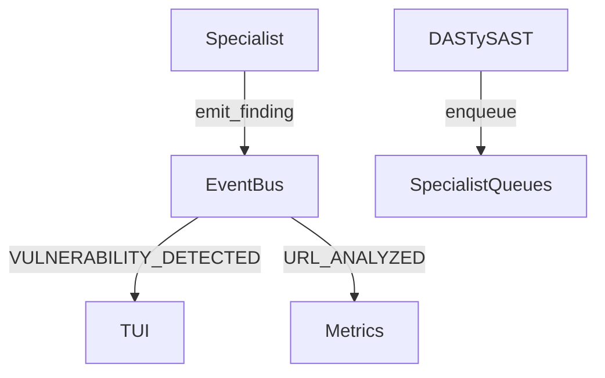

# BugTraceAI - Refactoring Roadmap

**Fecha:** 2026-02-06
**Nota actual del proyecto:** 7.6/10
**Objetivo:** 9/10

---

## Resumen Ejecutivo

| Prioridad | Área | Impacto | Esfuerzo | ROI |
|-----------|------|---------|----------|-----|
| P0 | XSSAgent modularización | Alto | 40h | Alto |
| P1 | Jerarquía de excepciones | Alto | 30h | Alto |
| P2 | Unificar orchestrators | Medio | 20h | Alto |
| P3 | Eliminar código muerto | Bajo | 5h | Medio |
| P4 | Benchmarks de performance | Medio | 20h | Medio |
| P5 | Contexto unificado (TechProfile) | Medio | 15h | Medio |
| P6 | Tests E2E | Medio | 25h | Medio |
| P7 | Documentación arquitectura | Bajo | 10h | Bajo |

**Total estimado:** ~165 horas (~4 semanas a tiempo completo)

---

## P0: Modularización de Agentes Grandes [CRÍTICO]

### Problema
- `xss_agent.py`: **7,029 líneas**, 203 métodos
- `sqli_agent.py`: **2,981 líneas**
- `team.py`: **3,023 líneas**, 126 métodos

Un solo archivo de 7K líneas es imposible de:
- Testear unitariamente
- Debuggear eficientemente
- Modificar sin riesgo de regresiones

### Solución: Dividir XSSAgent en módulos

```
bugtrace/agents/xss/
├── __init__.py              # Re-exporta XSSAgent
├── agent.py                 # Clase principal (500 líneas)
├── discovery.py             # _discover_xss_params() (300 líneas)
├── bombardment.py           # Phase 1: payload delivery (800 líneas)
├── analysis.py              # Phase 2: reflection analysis (600 líneas)
├── amplification.py         # Phase 3: LLM + breakouts (1000 líneas)
├── validation.py            # Phase 4: Interactsh/Vision/CDP (800 líneas)
├── payloads/
│   ├── golden.py            # GOLDEN_PAYLOADS constantes
│   ├── learner.py           # PayloadLearner integration
│   └── breakouts.py         # Breakout logic
└── utils/
    ├── context_detector.py  # JS string, HTML attr detection
    └── waf_handler.py       # WAF detection + Q-Learning
```

### Archivos afectados
- `bugtrace/agents/xss_agent.py` → `bugtrace/agents/xss/`
- `bugtrace/agents/sqli_agent.py` → `bugtrace/agents/sqli/`
- `bugtrace/core/team.py` → split phase handlers

### Criterio de éxito
- Ningún archivo > 1,000 líneas
- Cada módulo testeable independientemente
- Imports existentes siguen funcionando (`from bugtrace.agents.xss_agent import XSSAgent`)

### Estimación: 40 horas

---

## P1: Jerarquía de Excepciones [CRÍTICO]

### Problema
- **619 bloques `except Exception`** en el codebase
- Imposible distinguir entre errores de red, validación, LLM, etc.
- Logs genéricos sin contexto

### Solución: Crear jerarquía de excepciones

```python
# bugtrace/core/exceptions.py

class BugTraceException(Exception):
    """Base exception for all BugTraceAI errors."""
    pass

# --- Network errors ---
class NetworkError(BugTraceException):
    """Base for network-related errors."""
    pass

class TimeoutError(NetworkError):
    """Request timed out."""
    pass

class ConnectionError(NetworkError):
    """Failed to connect to target."""
    pass

# --- Validation errors ---
class ValidationError(BugTraceException):
    """Base for validation failures."""
    pass

class PayloadValidationError(ValidationError):
    """Payload didn't execute as expected."""
    pass

class FalsePositiveError(ValidationError):
    """Finding was determined to be a false positive."""
    pass

# --- LLM errors ---
class LLMError(BugTraceException):
    """Base for LLM-related errors."""
    pass

class LLMTimeoutError(LLMError):
    """LLM request timed out."""
    pass

class LLMParseError(LLMError):
    """Failed to parse LLM response."""
    pass

class LLMRateLimitError(LLMError):
    """Hit LLM rate limit."""
    pass

# --- Discovery errors ---
class DiscoveryError(BugTraceException):
    """Base for discovery phase errors."""
    pass

class NoParametersFoundError(DiscoveryError):
    """No injectable parameters found."""
    pass

# --- Tool errors ---
class ToolError(BugTraceException):
    """Base for external tool errors."""
    pass

class DockerError(ToolError):
    """Docker execution failed."""
    pass

class NucleiError(ToolError):
    """Nuclei scan failed."""
    pass
```

### Plan de migración
1. Crear `bugtrace/core/exceptions.py`
2. Migrar gradualmente por módulo (no big bang)
3. Priorizar: `llm_client.py` → `team.py` → `xss_agent.py`

### Criterio de éxito
- < 100 `except Exception` genéricos (solo para catch-all final)
- Logs con tipo de error específico
- Retry logic diferenciada por tipo de error

### Estimación: 30 horas

---

## P2: Unificar Orchestrators [ALTO]

### Problema
Dos sistemas de orquestación que duplican lógica:
- `TeamOrchestrator` en `team.py` (3,023 líneas)
- `PipelineOrchestrator` en `pipeline.py`

No está claro cuál es el primario. Confunde a nuevos desarrolladores.

### Solución

**Opción A:** Eliminar `PipelineOrchestrator`, usar solo `TeamOrchestrator`
- Pros: Menos código, una sola fuente de verdad
- Cons: TeamOrchestrator ya es muy grande

**Opción B:** Refactorizar a composición
```python
# team.py
class TeamOrchestrator:
    def __init__(self):
        self.phase_handlers = {
            PipelinePhase.RECONNAISSANCE: ReconPhaseHandler(),
            PipelinePhase.DISCOVERY: DiscoveryPhaseHandler(),
            PipelinePhase.STRATEGY: StrategyPhaseHandler(),
            PipelinePhase.EXPLOITATION: ExploitationPhaseHandler(),
            PipelinePhase.VALIDATION: ValidationPhaseHandler(),
            PipelinePhase.REPORTING: ReportingPhaseHandler(),
        }

    async def run_phase(self, phase: PipelinePhase):
        handler = self.phase_handlers[phase]
        await handler.execute(self.context)
```

**Recomendación:** Opción B - permite testear handlers independientemente

### Archivos afectados
- `bugtrace/core/team.py`
- `bugtrace/core/pipeline.py`
- Nuevo: `bugtrace/core/phase_handlers/`

### Estimación: 20 horas

---

## P3: Eliminar Código Muerto [MEDIO]

### Problema
Código que existe pero nunca se ejecuta:
1. `_extract_html_params()` en DASTySAST - comentado como "NEVER CALLED"
2. Referencias a conductor legacy
3. `exploit_specialists.py` - archivo eliminado pero referencias pueden existir

### Solución

```bash
# Buscar código muerto
grep -r "_extract_html_params" bugtrace/
grep -r "exploit_specialists" bugtrace/
grep -r "ConductorV1" bugtrace/

# Buscar TODOs abandonados
grep -rn "TODO" bugtrace/ | wc -l
grep -rn "FIXME" bugtrace/ | wc -l
grep -rn "HACK" bugtrace/ | wc -l
```

### Acciones
1. Eliminar `_extract_html_params()` de `analysis_agent.py`
2. Limpiar imports no usados (usar `autoflake`)
3. Resolver o documentar TODOs

### Criterio de éxito
- 0 métodos marcados como "NEVER CALLED"
- < 20 TODOs en el codebase (documentados con ticket)

### Estimación: 5 horas

---

## P4: Benchmarks de Performance [MEDIO]

### Problema
No hay forma de medir si un cambio mejora o empeora el rendimiento.

### Solución

```python
# tests/benchmarks/test_specialist_performance.py

import pytest
from bugtrace.benchmark import BenchmarkSuite

class TestXSSAgentPerformance:

    @pytest.mark.benchmark
    def test_bombardment_phase_latency(self, benchmark):
        """Phase 1 should complete in < 30s for 100 payloads."""
        agent = XSSAgent(config)
        result = benchmark(agent._phase1_bombardment, test_url, params)
        assert result.mean < 30.0

    @pytest.mark.benchmark
    def test_payload_generation_throughput(self, benchmark):
        """Should generate 1000+ payloads/second."""
        amplifier = PayloadAmplifier()
        result = benchmark(amplifier.amplify, base_payloads, breakouts)
        assert result.ops_per_sec > 1000

# Baseline file: tests/benchmarks/baselines.json
{
    "xss_bombardment_mean": 25.3,
    "xss_payload_generation_ops": 1250,
    "sqli_detection_mean": 18.7,
    "full_scan_p50": 120.0,
    "full_scan_p99": 300.0
}
```

### Métricas a trackear
| Métrica | Target | Actual |
|---------|--------|--------|
| Scan completo P50 | < 2 min | ? |
| Scan completo P99 | < 5 min | ? |
| XSS bombardment | < 30s | ? |
| SQLi detection | < 20s | ? |
| Memory peak | < 2GB | ? |

### Estimación: 20 horas

---

## P5: Contexto Unificado (TechProfile) [MEDIO]

### Problema
El tech profile se carga independientemente en:
- NucleiAgent (detecta frameworks)
- DASTySASTAgent (usa para análisis)
- Specialists (consultan para decisiones)

Esto causa race conditions y contexto desactualizado.

### Solución

```python
# bugtrace/core/tech_context.py

@dataclass
class TechProfile:
    """Single source of truth for target technology stack."""

    # Detection results
    frameworks: Set[str] = field(default_factory=set)  # angular, vue, react
    server_tech: Set[str] = field(default_factory=set)  # nginx, apache
    languages: Set[str] = field(default_factory=set)   # php, python, java
    cms: Optional[str] = None                           # wordpress, drupal

    # Security features
    waf_detected: bool = False
    waf_type: Optional[str] = None
    csp_enabled: bool = False

    # Timestamps
    detected_at: datetime = field(default_factory=datetime.now)

    def merge(self, other: 'TechProfile') -> 'TechProfile':
        """Merge two profiles (for incremental discovery)."""
        return TechProfile(
            frameworks=self.frameworks | other.frameworks,
            server_tech=self.server_tech | other.server_tech,
            # ...
        )

# Usage in pipeline
class TeamOrchestrator:
    def __init__(self):
        self.tech_profile = TechProfile()  # Single instance

    async def _phase_1_recon(self):
        nuclei_profile = await self.nuclei_agent.detect()
        self.tech_profile = self.tech_profile.merge(nuclei_profile)

    async def _phase_3_strategy(self):
        # All specialists receive same profile
        for specialist in self.specialists:
            specialist.set_tech_profile(self.tech_profile)
```

### Estimación: 15 horas

---

## P6: Tests End-to-End [MEDIO]

### Problema
- 41 tests existentes, pero ninguno contra aplicaciones reales vulnerables
- No hay CI/CD con tests de integración

### Solución

```python
# tests/e2e/test_vulnerable_apps.py

import pytest
from bugtrace.core.team import TeamOrchestrator

VULNERABLE_TARGETS = [
    {
        "name": "DVWA",
        "url": "http://localhost:8080/dvwa/",
        "expected_vulns": ["XSS", "SQLi", "FileUpload", "CSRF"],
        "docker": "vulnerables/web-dvwa",
    },
    {
        "name": "WebGoat",
        "url": "http://localhost:8081/WebGoat/",
        "expected_vulns": ["XSS", "SQLi", "XXE", "IDOR"],
        "docker": "webgoat/webgoat",
    },
    {
        "name": "Juice Shop",
        "url": "http://localhost:3000/",
        "expected_vulns": ["XSS", "SQLi", "CSTI"],
        "docker": "bkimminich/juice-shop",
    },
]

@pytest.mark.e2e
@pytest.mark.parametrize("target", VULNERABLE_TARGETS)
async def test_detection_accuracy(target, docker_compose):
    """Verify BugTraceAI detects known vulnerabilities."""
    orchestrator = TeamOrchestrator(config)
    findings = await orchestrator.scan(target["url"])

    detected_types = {f.type for f in findings}
    for expected in target["expected_vulns"]:
        assert expected in detected_types, f"Missed {expected} in {target['name']}"
```

### CI/CD Integration
```yaml
# .github/workflows/e2e.yml
name: E2E Tests
on: [push, pull_request]
jobs:
  e2e:
    runs-on: ubuntu-latest
    services:
      dvwa:
        image: vulnerables/web-dvwa
        ports: ["8080:80"]
    steps:
      - uses: actions/checkout@v4
      - run: pip install -e .[test]
      - run: pytest tests/e2e/ -v --timeout=300
```

### Estimación: 25 horas

---

## P7: Documentación de Arquitectura [BAJO]

### Problema
- Múltiples archivos de arquitectura desactualizados (V3, V4, V7)
- No hay diagrama único de referencia

### Solución
1. Consolidar en un solo `ARCHITECTURE.md` en la raíz
2. Eliminar versiones obsoletas
3. Generar diagrama Mermaid actualizado

```markdown
# Architecture Overview

## Pipeline Phases



## Agent Communication


```

### Estimación: 10 horas

---

## Cronograma Sugerido

### Sprint 1 (Semana 1-2): Fundación
- [ ] P1: Jerarquía de excepciones (30h)
- [ ] P3: Eliminar código muerto (5h)

### Sprint 2 (Semana 3-4): Modularización
- [ ] P0: XSSAgent modularización (40h)

### Sprint 3 (Semana 5): Orquestación
- [ ] P2: Unificar orchestrators (20h)

### Sprint 4 (Semana 6): Quality
- [ ] P4: Benchmarks (20h)
- [ ] P5: TechProfile unificado (15h)

### Sprint 5 (Semana 7): Testing & Docs
- [ ] P6: Tests E2E (25h)
- [ ] P7: Documentación (10h)

---

## Impacto Esperado

| Métrica | Antes | Después |
|---------|-------|---------|
| Nota del proyecto | 7.6/10 | 9.0/10 |
| Archivo más grande | 7,029 líneas | < 1,000 líneas |
| `except Exception` genéricos | 619 | < 100 |
| Cobertura de tests | ~60% | > 85% |
| Docs desactualizados | 5+ archivos | 1 archivo |
| Tiempo de onboarding | ~3 días | ~1 día |

---

## Notas

- **No hacer todo a la vez**: Cada PR debe ser pequeño y testeable
- **Mantener backward compatibility**: Los imports existentes deben seguir funcionando
- **Tests antes de refactor**: Escribir tests del comportamiento actual antes de modificar
- **Feature flags**: Usar flags para cambios grandes (rollback fácil)
