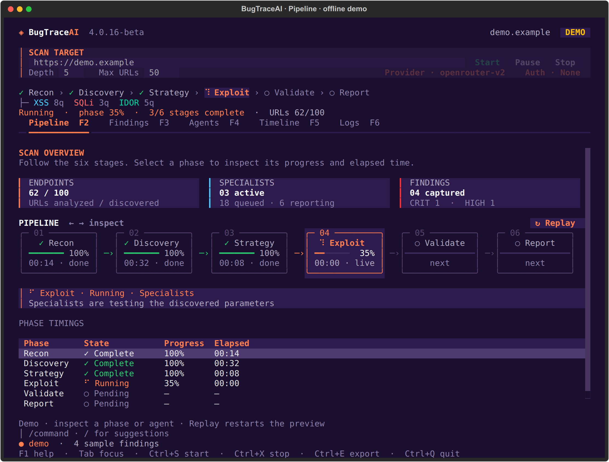
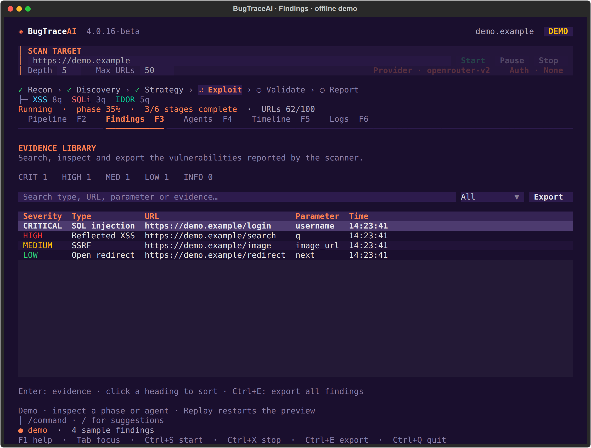
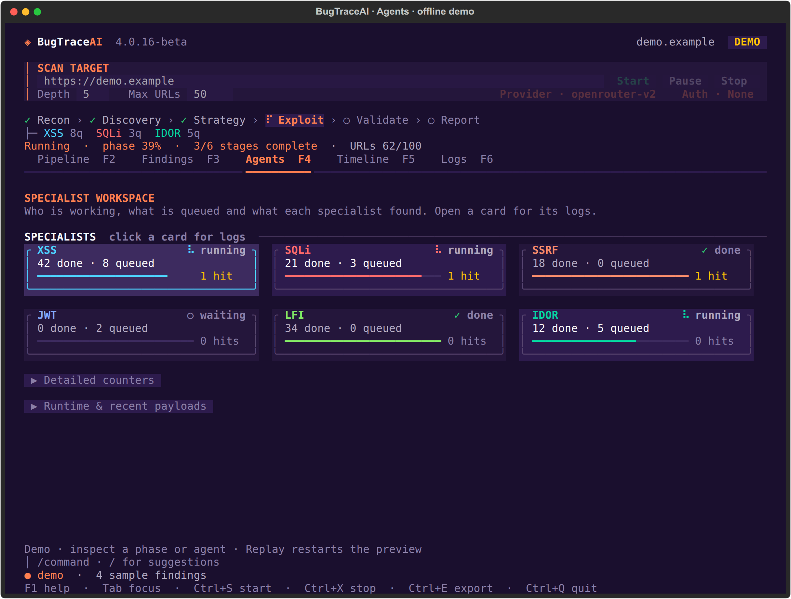
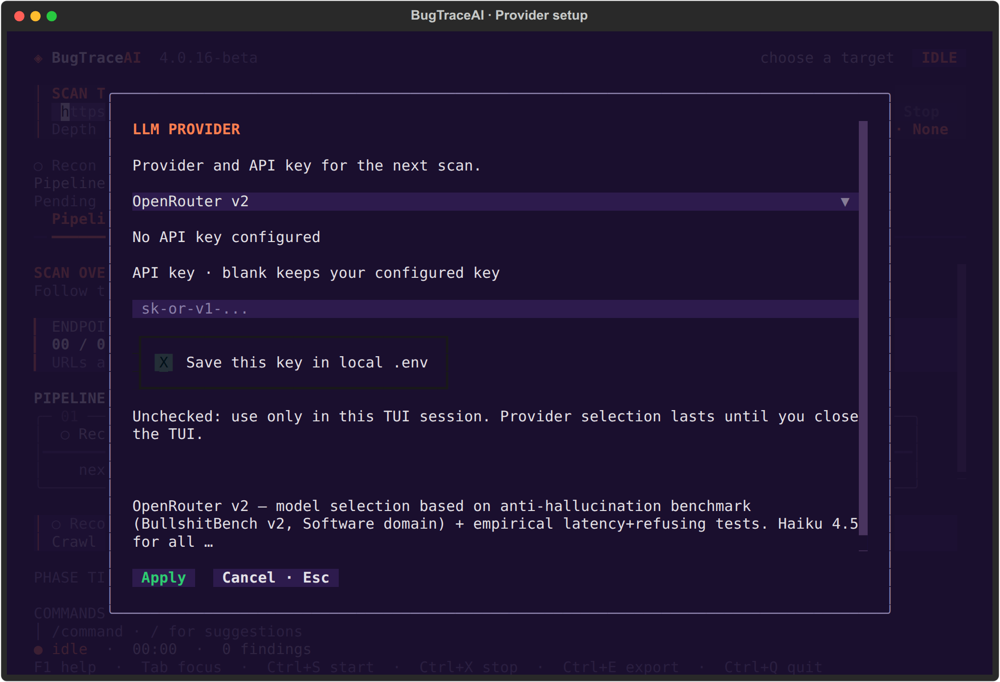
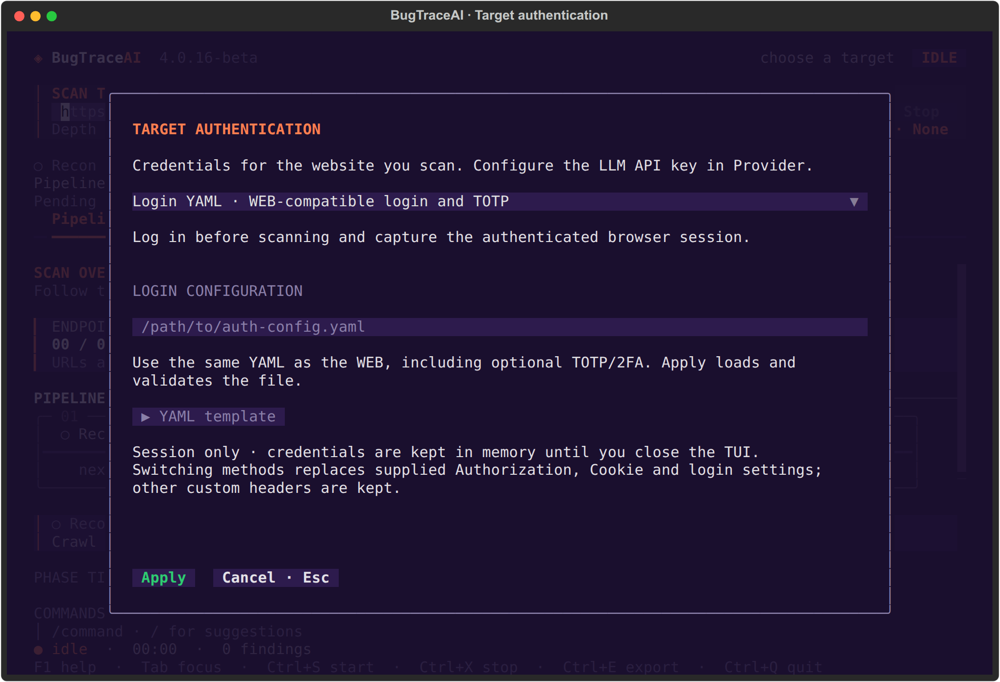

# BugTraceAI-CLI

[](https://bugtraceai.com) [](https://github.com/BugTraceAI/BugTraceAI-CLI/releases) [](INSTALLATION.md) [](LICENSE) [](https://deepwiki.com/BugTraceAI/BugTraceAI-CLI)

**Autonomous security scans with an interactive terminal workspace, REST API and MCP.**

BugTraceAI combines LLM-guided analysis with specialist tools and browser
validation. Follow the scan, inspect evidence and configure providers from the
terminal, or connect the engine to BugTraceAI-WEB and your own AI assistant.
Use it only against applications you are authorized to test.

## Terminal workspace



The TUI follows **Recon → Discovery → Strategy → Exploit → Validate → Report**.
Set the target URL, Depth and Max URLs at the top. The phase strip, counters,
timings and scan controls stay visible while you switch views.

<table>
  <tr>
    <td width="50%"><strong>Findings</strong><br/>Search, sort and inspect evidence.<br/></td>
    <td width="50%"><strong>Agents</strong><br/>Follow specialist states and queues.<br/></td>
  </tr>
  <tr>
    <td width="50%"><strong>Provider · F7</strong><br/>Select the LLM provider and configure its API key.<br/></td>
    <td width="50%"><strong>Target Auth · F8</strong><br/>Use a Bearer token or a login YAML with optional TOTP.<br/></td>
  </tr>
</table>

Pipeline, Findings and Agents captures use the built-in offline demo in
4.0.16-beta. Sample findings illustrate the interface. Provider and Auth captures
show the actual setup dialogs without credentials.

[Install](#install) · [Terminal controls](#terminal-controls) ·
[Install with your AI coding agent](#install-with-your-ai-coding-agent) ·
[API and MCP](#api-and-mcp) · [Configuration and reports](#configuration-and-reports)

## Scan engine

The shared engine discovers endpoints, analyzes candidate findings, routes work
to specialists and collects evidence through the validation/reporting stages.
Specialist coverage includes SQL injection, XSS, SSRF, IDOR, LFI, RCE, template
injection, XXE, JWT and redirect checks. Tool and browser evidence accompanies
the reported findings.

Provider presets include OpenRouter, Anthropic and Z.ai. The WEB connects to the
same CLI engine for web scans, report access and Model Lab through its API.

## Install

On Linux or macOS, clone the public repository and run its installer:

```bash
git clone https://github.com/BugTraceAI/BugTraceAI-CLI.git
cd BugTraceAI-CLI
./install.sh
```

Choose **TUI**, **API + MCP**, or **both**, then **local Python** or **Docker**.
The installer selects the interface dependencies and offers an optional
user-global `btai` command for TUI/both. It also offers to open the TUI when
installation finishes. Accept to open immediately; the current terminal does
not need a refreshed PATH. Use `--launch no` for an unattended install.

| Profile | Command |
| --- | --- |
| Local TUI + global command | `./install.sh --interface tui --runtime local --global yes` |
| Docker API + MCP | `./install.sh --interface api --runtime docker --global no` |
| Docker API + TUI + global command | `./install.sh --interface both --runtime docker --global yes` |
| Update or repair the saved profile | `./install.sh --reuse` |

Local installation needs Python 3.10+. The installer prepares missing Linux
pip/venv tools and Docker/Compose for the Docker profile. On macOS, Docker
setup uses an existing Docker Desktop or Homebrew/Colima. Some specialist tools
also use Docker during local scans. TUI adds
Textual; API adds FastAPI, Uvicorn, WebSockets and MCP. Existing environments
retain previously installed packages when you change profiles.

Choices are saved in `.bugtrace-install.env` without API keys. See
[INSTALLATION.md](INSTALLATION.md) for prerequisites and runtime-specific setup.

### Open the real TUI

```bash
./bugtraceai-cli
# With global registration, open a new terminal and run from any directory:
btai
```

Configure **Provider/F7**, enter your target, choose crawl limits and press
**Start**. Opening the workspace does not start a scan. A real scan requires a
provider key. In Provider, uncheck **Save this key in local .env** to keep a new
key only for the current session.

Use **Auth/F8** for the target website's credentials: a masked Bearer token or
a WEB-compatible login YAML, with optional TOTP/2FA. These target credentials
stay in the TUI session. Auth can be edited before a scan or after it finishes.
The current YAML format and example are in
[Target authentication](INSTALLATION.md#target-authentication).

To open a full interactive scan directly, or explicitly preview sample data:

```bash
./bugtraceai-cli full https://target.example
./bugtraceai-cli tui --demo
```

### Docker TUI

```bash
# TUI-only Docker profile: interactive scanner, no published server ports
docker compose -f docker-compose.tui.yml run --rm scanner

# Both interfaces installed: open the TUI inside the API container
docker compose exec api python3 -m bugtrace tui
```

The global `btai` helper honors the selected local/Docker profile. Keep the
registered checkout at its installation path; rerun registration after moving
it. API-only installations do not offer the global TUI command.

## Terminal controls

| View | Key | Purpose |
| --- | --- | --- |
| Pipeline | F2 | Scan stages, progress, counters and elapsed times |
| Findings | F3 | Search, sort, inspect and export vulnerability evidence |
| Agents | F4 | Specialist states, queues, counts and runtime details |
| Timeline | F5 | Scan milestones and alerts |
| Logs | F6 | Search engine output and filter by agent |
| Provider | F7 | LLM provider and masked API-key setup |
| Auth | F8 | Target Bearer token or login YAML |

**F1** opens help; **Tab** moves focus; **Ctrl+S** starts; **Ctrl+X** stops;
**Ctrl+E** exports captured findings; **Ctrl+Q** quits. Pause takes effect at the
next pipeline checkpoint. The top form accepts the target URL; the lower bar
accepts commands such as `/help`, `/provider`, `/auth`, `/pause`, `/resume`,
`/stop`, `/findings` and `/export`.

## Install with your AI coding agent

Copy this prompt into an agent with terminal access, such as Claude Code,
Cursor or Codex. The default installs the real TUI and a global `btai` command
on Linux/macOS. To deploy a server instead, change the first line to specify
**API + MCP** or **both**, and **local** or **Docker**.

```text
Install the current public BugTraceAI-CLI 4.x on this machine: local TUI,
with the user-global btai command. Perform the installation, not just a plan.

Check the OS, Python version and available tools. Read README.md,
INSTALLATION.md and ./install.sh --help from
https://github.com/BugTraceAI/BugTraceAI-CLI.git before installing.

Clone into a suitable user-owned directory. If an installation already exists,
preserve its configuration, credentials and uncommitted changes. Reuse its
saved profile with ./install.sh --reuse unless I request a profile change.
Do not replace an existing checkout or change its repository/branch silently.

For a fresh local TUI installation, run:
./install.sh --interface tui --runtime local --global yes
If I request API + MCP or both, use --interface api or both and my selected
--runtime local or docker. Use --global no for API-only installations.
Handle the installer's prompts, install the required dependencies and resolve
setup errors using the repository instructions. Do not switch runtime without
asking. Keep any system privilege/password prompt in my local terminal.

I will configure the LLM key later through Provider/F7 in the TUI; do not ask
me to paste credentials into chat or print existing secrets. Target login
credentials are configured separately through Auth/F8.

Verify the installed version, saved profile and selected interface. For TUI,
check startup and quit in an interactive terminal if available; otherwise
verify imports and report that the visual check is still pending. When requested, verify btai
registration and PATH in a fresh shell. For an API installation, check /health
using the actual configured port. Do not start a scan as part of installation.

Finish with the installation directory, selected profile, verification results
and exact commands to open the TUI or API. Tell me whether a new terminal is
needed for btai.
```

See [INSTALLATION.md](INSTALLATION.md) for profiles, Provider/F7, Auth/F8 and
troubleshooting. Installation does not require running a scan.

## API and MCP

Install the `api` or `both` profile to use the engine without opening the TUI.
For local installations:

```bash
./bugtraceai-cli serve --port 8000
# In a separate terminal, MCP defaults to STDIO:
./bugtraceai-cli mcp
# Optional HTTP/SSE transport:
./bugtraceai-cli mcp --sse --host 127.0.0.1 --port 8001
```

The API exposes `/health` and `/docs`. For Docker API/both profiles, the
installer starts the API/MCP Compose services and records the selected ports
in `.env`; use `docker compose up -d` to start them again. Connect an SSE client
to `http://localhost:<MCP_PORT>/sse` using the actual configured MCP port.

BugTraceAI-WEB uses the CLI API for scans, progress and reports. MCP clients can
control scans through the engine's tools. Configure provider credentials locally
before scanning. See [API and MCP](INSTALLATION.md#api-and-mcp) for details.

## Configuration and reports

`bugtraceaicli.conf` contains the engine settings; provider credentials can be
configured in local `.env`. The TUI offers Provider/F7 and Auth/F8 for scan setup.
See [custom provider configuration](docs/CUSTOM_PROVIDERS.md) for additional
provider options. Read the selected provider preset rather than relying on
historical model names from older releases.

Reports are written beneath the configured report directory. Scan deliverables
include `final_report.md`, `validated_findings.json`, `engagement_data.json`
and `report.html`, with evidence and specialist artifacts as available.
**Ctrl+E** or `/export` exports the findings captured by the TUI as JSON.

Explicit command-line scans remain available for scripts:

```bash
./bugtraceai-cli scan https://target.example
./bugtraceai-cli scan https://target.example --auth-config auth-config.yaml
./bugtraceai-cli --help
```

## Documentation and releases

- [Installation, profiles, authentication and terminal controls](INSTALLATION.md)
- [Release notes](https://github.com/BugTraceAI/BugTraceAI-CLI/releases)
- [BugTraceAI ecosystem](https://github.com/BugTraceAI/BugTraceAI)
- [Launcher](https://github.com/BugTraceAI/BugTraceAI-Launcher)
- [WEB dashboard](https://github.com/BugTraceAI/BugTraceAI-WEB)
- [DeepWiki](https://deepwiki.com/BugTraceAI/BugTraceAI-CLI)

The public CLI is a beta. Use scans only on explicitly authorized targets.

## License

Apache-2.0 for BugTraceAI-owned material in this public distribution.
See [LICENSE](LICENSE), [NOTICE](NOTICE) and [license history](LICENSE-HISTORY.md).

[bugtraceai.com](https://bugtraceai.com) · [@yz9yt](https://github.com/yz9yt)
