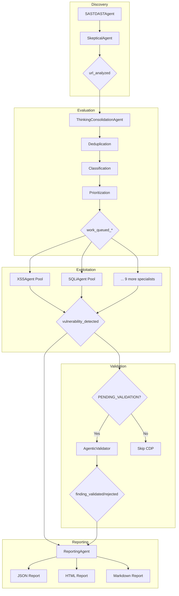
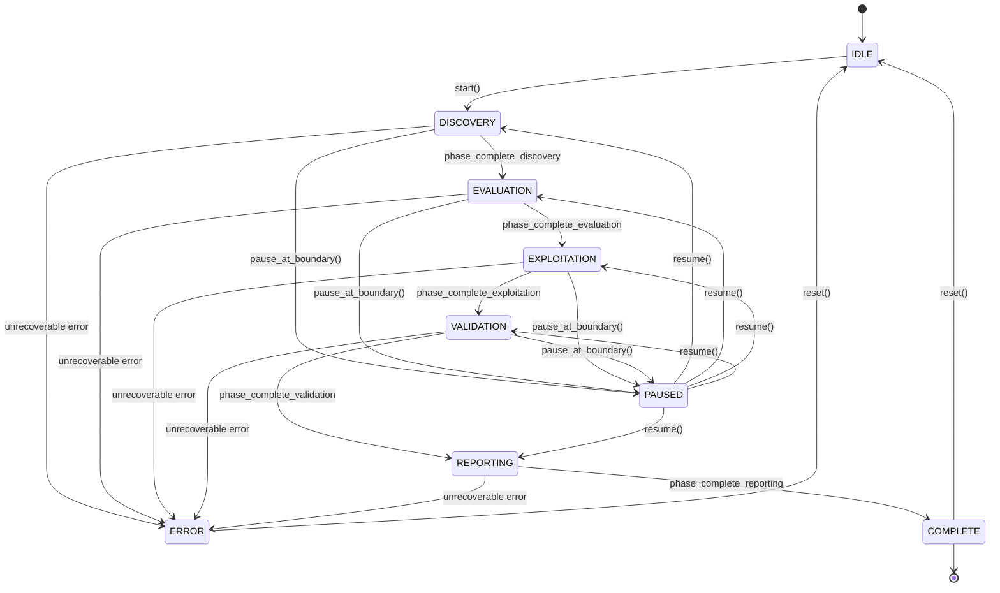

# Pipeline Architecture: 5-Phase Execution Model

> **Module:** `bugtrace.core.pipeline`
> **Version:** 2.0.0
> **Updated:** 2026-01-29

## Table of Contents

1. [Overview](#overview)
2. [Pipeline Phases](#pipeline-phases)
3. [Architecture Diagram](#architecture-diagram)
4. [Transition Rules](#transition-rules)
5. [State Machine](#state-machine)
6. [Integration Points](#integration-points)
7. [Configuration](#configuration)
8. [Examples](#examples)

---

## Overview

### What is the 5-Phase Model?

The BugTraceAI pipeline implements a **5-phase execution model** for vulnerability scanning. Each phase represents a distinct stage of the security assessment process, with clear boundaries, responsibilities, and event-driven transitions.

```
DISCOVERY -> EVALUATION -> EXPLOITATION -> VALIDATION -> REPORTING
```

This architecture enables:
- **Parallel processing** within phases (multiple specialists working concurrently)
- **Sequential progression** between phases (controlled data flow)
- **Event-driven coordination** (decoupled agent communication)
- **Pause/resume capability** (at phase boundaries)
- **Graceful shutdown** (drain queues, complete in-flight work)

### Why 5 Phases?

The previous 4-phase model combined discovery and evaluation, leading to:
- Mixed responsibilities in the SASTDASTAgent
- Difficulty in measuring deduplication effectiveness
- No clear point for false positive elimination

The 5-phase model separates concerns:

| Phase | Responsibility | Key Benefit |
|-------|---------------|-------------|
| Discovery | URL analysis, raw finding generation | Clean input processing |
| Evaluation | Deduplication, classification, prioritization | 40-60% noise reduction |
| Exploitation | Specialist payload testing | Parallel specialist execution |
| Validation | CDP-based confirmation of edge cases | 99% CDP load reduction target |
| Reporting | Deliverable generation | Clean output processing |

### Key Benefits

1. **CDP Reduction (99% target)**: By validating most findings via HTTP-first techniques during Exploitation, only edge cases (DOM XSS, complex event handlers) require CDP/Playwright.

2. **Early False Positive Elimination**: The SkepticalAgent in Discovery phase eliminates obvious false positives before they reach specialists.

3. **Parallel Exploitation**: 11 specialist agents (XSS, SQLi, CSTI, LFI, IDOR, RCE, SSRF, XXE, JWT, OpenRedirect, PrototypePollution) process their queues concurrently.

4. **Event-Driven Coordination**: Phases communicate via the EventBus, enabling loose coupling and testability.

---

## Pipeline Phases

### Phase 1: DISCOVERY

**Purpose:** Analyze URLs to discover potential vulnerability patterns.

**Key Agent:** SASTDASTAgent with SkepticalAgent review

**Responsibilities:**
- Parse URL parameters, forms, and inputs
- Apply SAST heuristics for code patterns
- Apply DAST heuristics for runtime behavior
- Run SkepticalAgent to filter obvious false positives
- Emit findings as `url_analyzed` events

**Events Emitted:**
```python
EventType.URL_ANALYZED = "url_analyzed"
```

**Event Payload:**
```python
{
    "scan_context": "scan_abc123",
    "url": "https://example.com/search",
    "parameter": "q",
    "findings": [
        {
            "vuln_type": "xss",
            "confidence": 0.85,
            "reasoning": "Reflected parameter in response",
            "skeptical_score": 7  # 1-10, higher = more likely real
        }
    ]
}
```

**Completion Criteria:**
- All URLs in scope have been analyzed
- `PHASE_COMPLETE_DISCOVERY` event emitted

**Transition:** DISCOVERY -> EVALUATION

---

### Phase 2: EVALUATION

**Purpose:** Deduplicate, classify, and prioritize findings from Discovery.

**Key Agent:** ThinkingConsolidationAgent

**Responsibilities:**
- Deduplicate findings using composite keys (vuln_type:parameter:url_path)
- Classify findings to appropriate specialist queues
- Calculate priority scores (severity 40%, fp_confidence 35%, skeptical_score 25%)
- Distribute work to specialist queues
- Emit `work_queued_*` events for coordination

**Events Subscribed:**
```python
EventType.URL_ANALYZED = "url_analyzed"
```

**Events Emitted:**
```python
# One per specialist type
EventType.WORK_QUEUED_XSS = "work_queued_xss"
EventType.WORK_QUEUED_SQLI = "work_queued_sqli"
EventType.WORK_QUEUED_CSTI = "work_queued_csti"
EventType.WORK_QUEUED_LFI = "work_queued_lfi"
EventType.WORK_QUEUED_IDOR = "work_queued_idor"
EventType.WORK_QUEUED_RCE = "work_queued_rce"
EventType.WORK_QUEUED_SSRF = "work_queued_ssrf"
EventType.WORK_QUEUED_XXE = "work_queued_xxe"
EventType.WORK_QUEUED_JWT = "work_queued_jwt"
EventType.WORK_QUEUED_OPENREDIRECT = "work_queued_openredirect"
EventType.WORK_QUEUED_PROTOTYPE_POLLUTION = "work_queued_prototype_pollution"
```

**Deduplication Key Format:**
```
{vuln_type}:{parameter}:{url_path}
```

**Priority Formula:**
```python
priority = (
    severity_weight * 0.40 +
    (1 - fp_confidence) * 0.35 +
    skeptical_score_normalized * 0.25
)
# Boosts: +20% if validated, +10% if 4+ votes
```

**Completion Criteria:**
- All `url_analyzed` events processed
- Dedup buffer empty
- Work distributed to specialist queues
- `PHASE_COMPLETE_EVALUATION` event emitted

**Transition:** EVALUATION -> EXPLOITATION

---

### Phase 3: EXPLOITATION

**Purpose:** Test vulnerability hypotheses with specialist payloads.

**Key Agents:** 11 Specialist Agents with Worker Pools

| Specialist | Queue | Default Workers | Focus |
|------------|-------|-----------------|-------|
| XSSAgent | xss_queue | 8 | Cross-site scripting |
| SQLiAgent | sqli_queue | 5 | SQL injection |
| CSTIAgent | csti_queue | 5 | Client-side template injection |
| LFIAgent | lfi_queue | 5 | Local file inclusion |
| IDORAgent | idor_queue | 5 | Insecure direct object reference |
| RCEAgent | rce_queue | 5 | Remote code execution |
| SSRFAgent | ssrf_queue | 5 | Server-side request forgery |
| XXEAgent | xxe_queue | 5 | XML external entity |
| JWTAgent | jwt_queue | 5 | JWT vulnerabilities |
| OpenRedirectAgent | openredirect_queue | 5 | Open redirect |
| PrototypePollutionAgent | prototype_pollution_queue | 5 | Prototype pollution |

**Responsibilities:**
- Consume work items from specialist queues
- Test payloads appropriate to vulnerability type
- Determine ValidationStatus for each finding
- Emit `vulnerability_detected` events for confirmed/pending findings

**Events Subscribed:**
```python
EventType.WORK_QUEUED_* = "work_queued_*"  # Pattern subscription
```

**Events Emitted:**
```python
EventType.VULNERABILITY_DETECTED = "vulnerability_detected"
```

**ValidationStatus Values:**
```python
class ValidationStatus(str, Enum):
    VALIDATED_CONFIRMED = "validated_confirmed"  # HTTP-first confirmed
    PENDING_VALIDATION = "pending_validation"    # Needs CDP validation
    VALIDATION_FAILED = "validation_failed"      # Could not confirm
    REJECTED_FALSE_POSITIVE = "rejected_fp"      # Determined to be FP
    SKIPPED = "skipped"                          # Not tested (rate limit, etc.)
```

**Event Payload:**
```python
{
    "scan_context": "scan_abc123",
    "specialist": "xss",
    "finding": {
        "url": "https://example.com/search",
        "parameter": "q",
        "payload": "<script>alert(1)</script>",
        "evidence": "Script reflected in response"
    },
    "status": "validated_confirmed",
    "validation_requires_cdp": False
}
```

**Completion Criteria:**
- All specialist queues empty
- All workers idle
- `PHASE_COMPLETE_EXPLOITATION` event emitted

**Transition:** EXPLOITATION -> VALIDATION

---

### Phase 4: VALIDATION

**Purpose:** Confirm edge-case findings that require CDP/Playwright validation.

**Key Agent:** AgenticValidator

**Responsibilities:**
- Subscribe to `vulnerability_detected` events
- Filter for `PENDING_VALIDATION` status only
- Queue findings requiring CDP validation
- Execute CDP-based validation (DOM inspection, event triggering)
- Emit `finding_validated` or `finding_rejected` events
- Track CDP load percentage (target: <1%)

**Events Subscribed:**
```python
EventType.VULNERABILITY_DETECTED = "vulnerability_detected"
```

**Events Emitted:**
```python
EventType.FINDING_VALIDATED = "finding_validated"
EventType.FINDING_REJECTED = "finding_rejected"
```

**CDP Load Tracking:**
```python
cdp_load_percent = (cdp_validated_count / total_findings) * 100
# Target: < 1%
```

**Edge Cases Requiring CDP:**
```python
EDGE_CASE_PATTERNS = {
    "dom_based_xss": ["document.write", "innerHTML", "eval"],
    "complex_event_handlers": ["onload", "onerror", "onmouseover"],
    "sink_analysis": ["location.href", "window.open"]
}
```

**Completion Criteria:**
- Validation queue empty
- All PENDING_VALIDATION findings processed
- `PHASE_COMPLETE_VALIDATION` event emitted

**Transition:** VALIDATION -> REPORTING

---

### Phase 5: REPORTING

**Purpose:** Generate deliverables (JSON, HTML, Markdown reports).

**Key Agent:** ReportingAgent

**Responsibilities:**
- Subscribe to `vulnerability_detected` and `finding_validated` events
- Collect all confirmed findings from:
  - `VALIDATED_CONFIRMED` (HTTP-first from specialists)
  - `finding_validated` (CDP-validated edge cases)
- Deduplicate findings by (url, parameter, payload) tuple
- Generate reports in multiple formats
- Track source attribution (event_bus, database, nuclei)

**Events Subscribed:**
```python
EventType.VULNERABILITY_DETECTED = "vulnerability_detected"
EventType.FINDING_VALIDATED = "finding_validated"
```

**Report Formats:**
- JSON: Machine-readable, full details
- HTML: Human-readable, styled report
- Markdown: Documentation-friendly format

**Validation Method Labels:**
```python
VALIDATION_METHODS = {
    "oob": "Out-of-Band Callback",
    "http": "HTTP Response Analysis",
    "playwright": "Playwright Browser Automation",
    "cdp": "Chrome DevTools Protocol",
    "sqlmap": "SQLMap Confirmation",
    "template": "Template Engine Detection",
    "fuzzer": "Go-based Fuzzer"
}
```

**Completion Criteria:**
- All reports generated
- `PHASE_COMPLETE_REPORTING` event emitted

**Transition:** REPORTING -> COMPLETE

---

## Architecture Diagram

### High-Level Flow

```
+-------------+     +-------------+     +--------------+     +-------------+     +------------+
|  DISCOVERY  | --> | EVALUATION  | --> | EXPLOITATION | --> | VALIDATION  | --> | REPORTING  |
+-------------+     +-------------+     +--------------+     +-------------+     +------------+
      |                   |                    |                   |                  |
  url_analyzed      work_queued_*      vulnerability_      finding_           report
                                        detected          validated          generated
      |                   |                    |                   |                  |
+-------------+     +-------------+     +--------------+     +-------------+     +------------+
| SASTDASTAgent|     | Thinking    |     | 11 Specialist|     | Agentic     |     | Reporting  |
| + Skeptical |     | Consolidation|     | WorkerPools |     | Validator   |     | Agent      |
+-------------+     +-------------+     +--------------+     +-------------+     +------------+
```

### Event Flow Diagram (Mermaid)



### State Transitions (Mermaid)



---

## Transition Rules

### VALID_TRANSITIONS Dictionary

The `VALID_TRANSITIONS` dictionary in `pipeline.py` defines all legal state transitions:

```python
VALID_TRANSITIONS: Dict[PipelinePhase, List[PipelinePhase]] = {
    # IDLE can only start discovery
    PipelinePhase.IDLE: [PipelinePhase.DISCOVERY],

    # Active phases follow linear progression with pause/error exits
    PipelinePhase.DISCOVERY: [
        PipelinePhase.EVALUATION,
        PipelinePhase.PAUSED,
        PipelinePhase.ERROR
    ],
    PipelinePhase.EVALUATION: [
        PipelinePhase.EXPLOITATION,
        PipelinePhase.PAUSED,
        PipelinePhase.ERROR
    ],
    PipelinePhase.EXPLOITATION: [
        PipelinePhase.VALIDATION,
        PipelinePhase.PAUSED,
        PipelinePhase.ERROR
    ],
    PipelinePhase.VALIDATION: [
        PipelinePhase.REPORTING,
        PipelinePhase.PAUSED,
        PipelinePhase.ERROR
    ],
    PipelinePhase.REPORTING: [
        PipelinePhase.COMPLETE,
        PipelinePhase.ERROR
    ],

    # PAUSED can resume to any active phase
    PipelinePhase.PAUSED: [
        PipelinePhase.DISCOVERY,
        PipelinePhase.EVALUATION,
        PipelinePhase.EXPLOITATION,
        PipelinePhase.VALIDATION,
        PipelinePhase.REPORTING
    ],

    # Terminal states can only reset to IDLE
    PipelinePhase.COMPLETE: [PipelinePhase.IDLE],
    PipelinePhase.ERROR: [PipelinePhase.IDLE]
}
```

### Automatic Transitions

The `PipelineOrchestrator` subscribes to phase completion events and automatically advances the pipeline:

```python
# Event -> Next Phase mapping
PHASE_COMPLETE_DISCOVERY -> EVALUATION
PHASE_COMPLETE_EVALUATION -> EXPLOITATION
PHASE_COMPLETE_EXPLOITATION -> VALIDATION
PHASE_COMPLETE_VALIDATION -> REPORTING
PHASE_COMPLETE_REPORTING -> COMPLETE
```

**Transition Logic:**

1. Phase completion event received
2. Verify event's `scan_context` matches current scan
3. Verify current phase matches expected (no duplicate processing)
4. Extract metrics from event payload
5. Call `_advance_phase()` with lock protection
6. Log transition

### Pause/Resume Behavior

**Pause Request:**
1. Set `_pause_requested` flag
2. Wait for current phase to reach boundary (no in-flight work)
3. Transition to `PAUSED` state
4. Emit `PIPELINE_PAUSED` event

**Resume Request:**
1. Clear `_pause_requested` flag
2. Transition from `PAUSED` to previous active phase
3. Emit `PIPELINE_RESUMED` event
4. Continue processing

**Phase Boundary:**
A phase boundary is reached when:
- All queues for that phase are empty
- All workers for that phase are idle
- The phase has naturally completed its work

### Error Handling

Any phase can transition to `ERROR` for unrecoverable failures:

```python
# Example error conditions
- Database connection lost
- Memory exhaustion
- Unhandled exception in agent
- External service unavailable (Playwright, LLM API)
```

From `ERROR`, only transition to `IDLE` is allowed (reset for new scan).

---

## State Machine

### PipelinePhase Enum

```python
class PipelinePhase(str, Enum):
    """
    Pipeline phases for 5-phase execution model.
    Inherits from str for JSON serialization compatibility.
    """
    # Not started
    IDLE = "idle"

    # Active phases (5-phase model)
    DISCOVERY = "discovery"       # SASTDASTAgent analyzing URLs
    EVALUATION = "evaluation"     # ThinkingConsolidationAgent processing
    EXPLOITATION = "exploitation" # Specialist agents testing payloads
    VALIDATION = "validation"     # AgenticValidator processing PENDING
    REPORTING = "reporting"       # ReportingAgent generating deliverables

    # Terminal states
    COMPLETE = "complete"  # Pipeline finished
    ERROR = "error"        # Unrecoverable failure

    # Control states
    PAUSED = "paused"      # User-requested pause
```

### PipelineState Dataclass

```python
@dataclass
class PipelineState:
    """Pipeline state machine with transition tracking."""

    scan_id: str                              # Unique scan identifier
    current_phase: PipelinePhase = IDLE       # Current phase
    previous_phase: Optional[PipelinePhase]   # For pause/resume
    started_at: float                         # Monotonic timestamp
    phase_started_at: float                   # Current phase start
    transitions: List[PipelineTransition]     # Transition history
    paused: bool = False                      # Pause flag
    pause_reason: Optional[str] = None        # Why paused
    error: Optional[str] = None               # Error message if ERROR state
```

### Key Methods

```python
# Check if transition is valid
state.can_transition(to_phase: PipelinePhase) -> bool

# Perform transition (raises ValueError if invalid)
state.transition(to_phase, reason, metrics) -> PipelineTransition

# Get timing information
state.get_phase_duration() -> float  # Seconds in current phase
state.get_total_duration() -> float  # Total pipeline duration

# Serialize for API/logging
state.to_dict() -> Dict[str, Any]
```

### Timing with Monotonic Clock

The pipeline uses `time.monotonic()` for accurate duration tracking:

```python
# Why monotonic?
# - Not affected by system clock changes
# - Guaranteed to be increasing
# - Suitable for measuring elapsed time

started_at = time.monotonic()       # Pipeline start
phase_started_at = time.monotonic() # Phase start

duration = time.monotonic() - started_at
```

---

## Integration Points

### TeamOrchestrator Integration

The `TeamOrchestrator` class integrates the pipeline via `_init_pipeline()`:

```python
class TeamOrchestrator:
    def __init__(self, ...):
        self._pipeline: Optional[PipelineOrchestrator] = None
        self._lifecycle: Optional[PipelineLifecycle] = None

    async def _init_pipeline(self, scan_id: str):
        """Initialize pipeline orchestration for a scan."""
        self._pipeline = PipelineOrchestrator(scan_id)
        self._lifecycle = PipelineLifecycle(
            self._pipeline.state,
            self._pipeline.event_bus
        )
        await self._pipeline.start()
```

**Public Methods:**

```python
# Pause at next phase boundary
await orchestrator.pause_pipeline()

# Resume from paused state
await orchestrator.resume_pipeline()

# Get current pipeline state
orchestrator.get_pipeline_state() -> Dict[str, Any]
```

### Agent Phase Completion Signaling

Agents signal phase completion via `PipelineLifecycle.signal_phase_complete()`:

```python
async def signal_phase_complete(
    self,
    phase: PipelinePhase,
    metrics: Dict[str, Any] = None
) -> None:
    """
    Signal that a phase has completed its work.
    Emits the appropriate PHASE_COMPLETE_* event.
    """
    event_map = {
        PipelinePhase.DISCOVERY: EventType.PHASE_COMPLETE_DISCOVERY,
        PipelinePhase.EVALUATION: EventType.PHASE_COMPLETE_EVALUATION,
        PipelinePhase.EXPLOITATION: EventType.PHASE_COMPLETE_EXPLOITATION,
        PipelinePhase.VALIDATION: EventType.PHASE_COMPLETE_VALIDATION,
        PipelinePhase.REPORTING: EventType.PHASE_COMPLETE_REPORTING,
    }

    await self.event_bus.emit(event_map[phase], {
        "scan_context": self.state.scan_id,
        "phase": phase.value,
        "timestamp": time.time(),
        **(metrics or {})
    })
```

### PipelineLifecycle for Graceful Shutdown

The `PipelineLifecycle` class manages:

1. **Worker Pool Registry:** Track registered pools for shutdown coordination
2. **Queue Draining:** Wait for queues to empty with timeout
3. **Pause Points:** Agents check `check_pause_point()` between work units

```python
class PipelineLifecycle:
    async def drain_queues(self, timeout: float = None) -> Dict[str, int]
    async def graceful_shutdown(self, timeout: float = None) -> bool
    async def pause_at_boundary(self, reason: str) -> bool
    async def resume() -> bool
    async def check_pause_point() -> bool  # For agents
```

**Agent Pause Point Example:**

```python
async def process_urls(self, urls: List[str]):
    for url in urls:
        # Check if we should pause
        if await self.lifecycle.check_pause_point():
            return  # Paused, stop processing

        await self.analyze_url(url)
```

---

## Configuration

### Pipeline Settings

Configuration via `bugtrace.core.config.settings`:

```python
# Phase timeout (default 600s = 10 minutes)
PIPELINE_PHASE_TIMEOUT = 600

# Queue drain timeout for shutdown (default 30s)
PIPELINE_DRAIN_TIMEOUT = 30

# Automatic phase transitions (default True)
PIPELINE_AUTO_TRANSITION = True

# Pause check interval (default 0.5s)
PIPELINE_PAUSE_CHECK_INTERVAL = 0.5
```

### Worker Pool Sizing

```python
# Default workers per specialist
WORKER_POOL_DEFAULT_SIZE = 5

# XSS specialist (higher volume)
WORKER_POOL_XSS_SIZE = 8

# SQLi specialist
WORKER_POOL_SQLI_SIZE = 5

# Shutdown timeout for worker pools
WORKER_POOL_SHUTDOWN_TIMEOUT = 30

# Dequeue timeout (allows periodic running checks)
WORKER_POOL_DEQUEUE_TIMEOUT = 5
```

---

## Examples

### Starting a Pipeline Scan

```python
from bugtrace.core.pipeline import PipelineOrchestrator, PipelinePhase

# Create orchestrator for scan
orchestrator = PipelineOrchestrator(scan_id="scan_123")

# Start pipeline (transitions IDLE -> DISCOVERY)
await orchestrator.start()

# Pipeline now processes automatically via events
# DISCOVERY -> EVALUATION -> EXPLOITATION -> VALIDATION -> REPORTING -> COMPLETE
```

### Pausing and Resuming

```python
from bugtrace.core.pipeline import PipelineLifecycle

# Access lifecycle from orchestrator
lifecycle = orchestrator._lifecycle  # In real code, use proper accessor

# Request pause (waits for phase boundary)
await lifecycle.pause_at_boundary("User requested")

# Later, resume
await lifecycle.resume()
```

### Monitoring Pipeline State

```python
# Get current state
state = orchestrator.get_state()

print(f"Current phase: {state['current_phase']}")
print(f"Total duration: {state['total_duration']:.1f}s")
print(f"Transitions: {state['transition_count']}")

# Check specific phase duration
print(f"Phase duration: {state['phase_duration']:.1f}s")
```

### Handling Graceful Shutdown

```python
# Initiate shutdown
lifecycle = PipelineLifecycle(state, event_bus)

# Stop worker pools and drain queues
clean = await lifecycle.graceful_shutdown(timeout=30)

if clean:
    print("Clean shutdown completed")
else:
    print("Shutdown timed out, some work may be lost")
```

---

## Related Documentation

- [Agent Architecture](./AGENT_ARCHITECTURE.md) - Detailed agent documentation
- [Testing Guide](./TESTING_GUIDE.md) - How to test pipeline components
- [Event Bus](../../bugtrace/core/event_bus.py) - Event system implementation
- [Pipeline Implementation](../../bugtrace/core/pipeline.py) - Source code

---

*Last updated: 2026-01-29*
